# Guida illustrata all'applicazione

> Ultima verifica: ottobre 2026. Le schermate sono prese sull'app in sviluppo usando l'azienda
> **AMBIENTA**: le fasi DATI e ANALISI sulla pratica del **bilancio di verifica 2026 a 6 mesi**,
> la fase PREVISIONALE e le griglie sullo scenario **«Budget 2027–2029»** (3 anni, anno base
> 2026). I numeri citati negli esempi sono letti dall'app, non inventati; se rigeneri i dati di
> prova, aggiornali qui insieme alle immagini in `docs/images/guida/`.

**A chi serve.** Questa è la guida d'uso: come si fa una cosa dall'inizio alla fine, con un
esempio sui numeri veri per ogni schermata. Non è il manuale del motore — per le formule c'è
[FORECASTING_GUIDE.md](budget/FORECASTING_GUIDE.md), per i contratti delle API
[API-PREVISIONALE.md](budget/API-PREVISIONALE.md). Ogni sezione chiude con un «Approfondisci»
che punta alla pagina tecnica giusta.

**Come è fatta l'app.** Un unico ingresso, la **home**, e due percorsi:

- **Da bilancio** — la pratica completa: *DATI* (anagrafica, import, rettifiche) → *ANALISI*
  (confronto, proiezione, indicatori, stampa) → *PREVISIONALE* (il wizard a 7 passi e le sue
  griglie). Le fasi e i passaggi stanno nella barra sotto l'intestazione, con un solo gate
  duro: nulla della fase ANALISI è raggiungibile finché le **Rettifiche non sono confermate**.
- **Startup** — stesso wizard, ma senza bilancio importato dietro: inserisci capitale e driver
  attesi (sezione 15).

La barra dice sempre dove sei (`1 DATI`, `2 ANALISI`, `3 PREVISIONALE`), con azienda e anno di
pratica a sinistra e il pulsante «Avanti: …» a destra.

---

# 0. La home — aziende e pratiche

`/` — dal menu in alto: **«Aziende & Pratiche»**

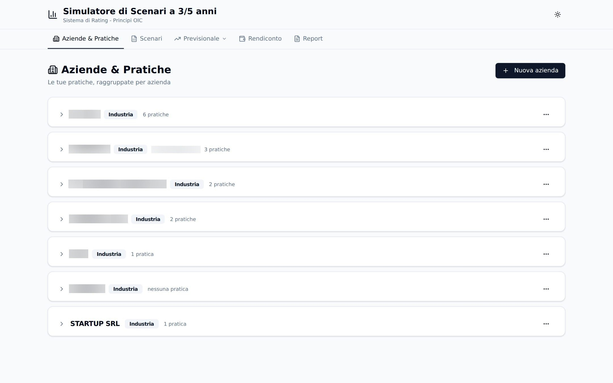

**Che cosa c'è a schermo**

- Intestazione **«Aziende & Pratiche»** e pulsante **«Nuova azienda»**.
- Una **scheda per azienda**: freccia per espandere, nome, settore, partita IVA, numero di
  pratiche, e un menu «…» a destra.
- Il tema chiaro/scuro in alto a destra.

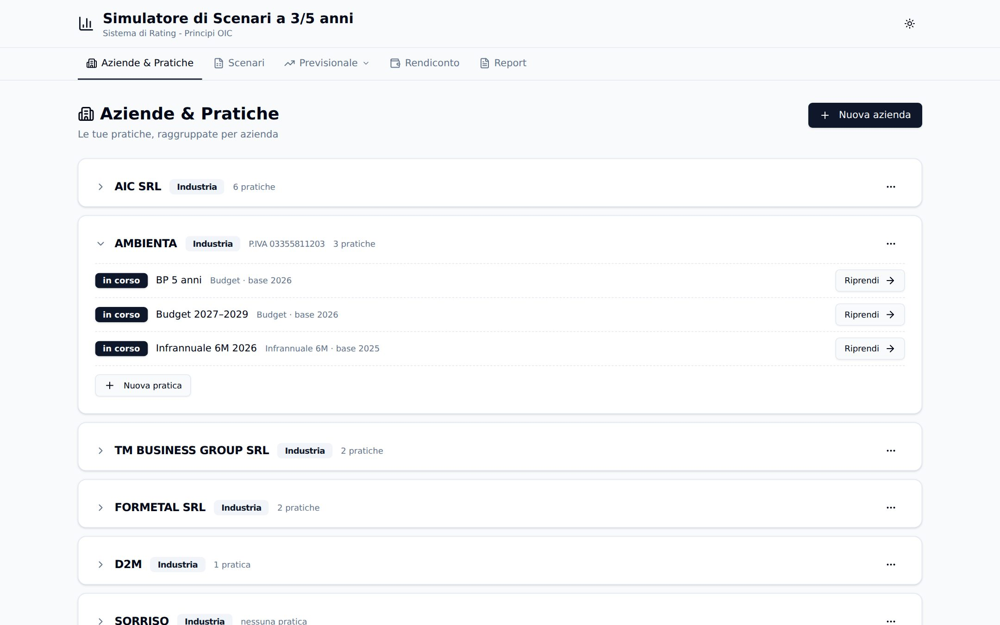

**Espandendo la scheda** compaiono gli anni già lavorati con **«Riprendi»** — riparte
dall'ultimo passaggio raggiunto — e **«Nuova pratica»**. La cache di dove eri sta nel tuo
browser, ma il server la riverifica all'apertura: quando non riesce a ricostruire la pratica —
per esempio una pratica vecchia con un budget salvato ma senza una pratica infrannuale dietro,
dove il giornale delle Rettifiche non c'è più — compare il banner **«Pratica da riaprire»**
(§ Troubleshooting).

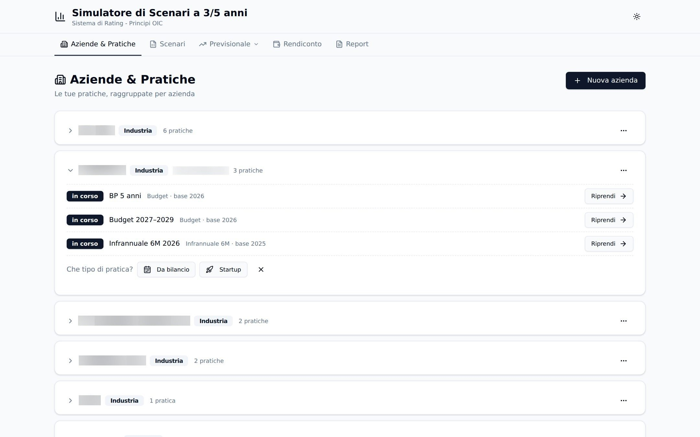

**«Nuova pratica»** apre un dialogo con la scelta fra **Da bilancio** (importi un bilancio,
anche solo di verifica, e poi analizzi) e **Startup** (nessun bilancio, solo ipotesi; sezione 15).

**«Nuova azienda»** apre un dialogo con **Nome\***, **Partita IVA** (11 cifre) e **Settore\*** a
tendina (Industria, Commercio, Servizi, Autotrasporti, Immobiliare, Edilizia). Il settore non è
un'etichetta: sceglie il modello Altman (Industria usa i 5 componenti, gli altri 4) e le soglie
FGPMI.

> ⚠ L'unica ricerca e l'unico filtro che la home conosce sono il tuo occhio: le aziende sono
> schede in elenco, senza barra di ricerca né ordinamento.

---

# FASE 1 · DATI

## 1. Anagrafica

`/pratica` → tab *Anagrafiche*

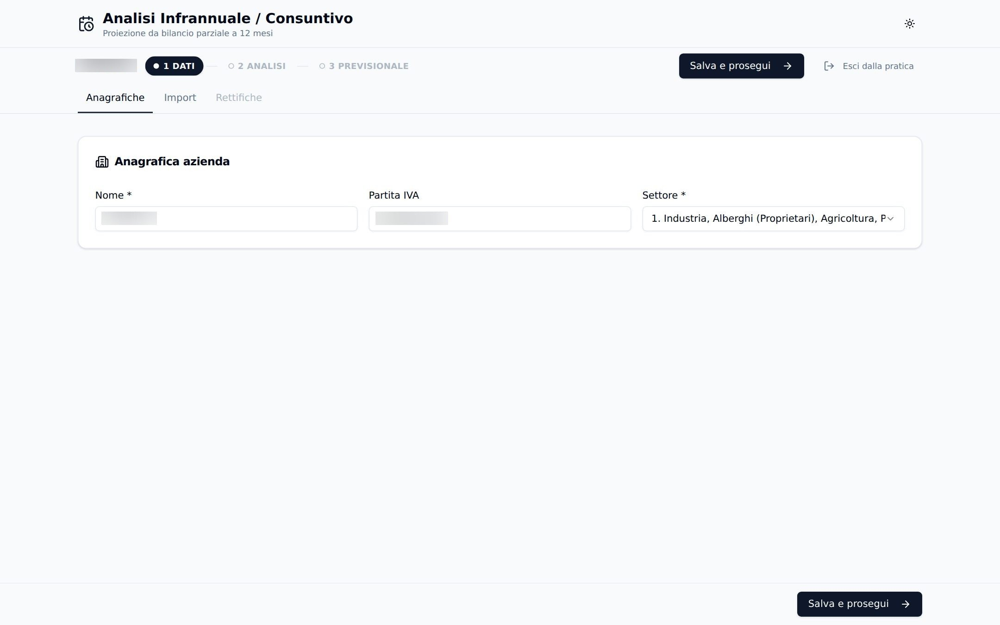

**A che cosa serve.** La carta d'identità dell'azienda su cui stai lavorando: verifichi di
essere sull'azienda giusta e correggi quello che l'import ha letto male.

**Che cosa c'è a schermo**

- **«Nome \*»**, **«Partita IVA»**, **«Settore \*»** a tendina —
  tutti modificabili; il settore decide Altman e FGPMI (§ 14).
- **«Salva e prosegui»** in basso a destra.

**Come si fa.** 1) correggi nome o partita IVA se l'import le ha sbagliate; 2) imposta il
settore giusto (se non sai quale, scegli quello del fatturato principale); 3) «Salva e prosegui».

**Esempio.** AMBIENTA è classificata **industria** (settore 1): il suo rating userà le soglie
FGPMI del settore 1 e il modello Altman a 5 componenti.

**Approfondisci** → [PRATICA-PERCORSO.md](frontend/PRATICA-PERCORSO.md)

## 2. Import

`/pratica` → tab *Import* (esiste anche una pagina autonoma `/import`, non collegata alla
navigazione: la via normale è questa tab)

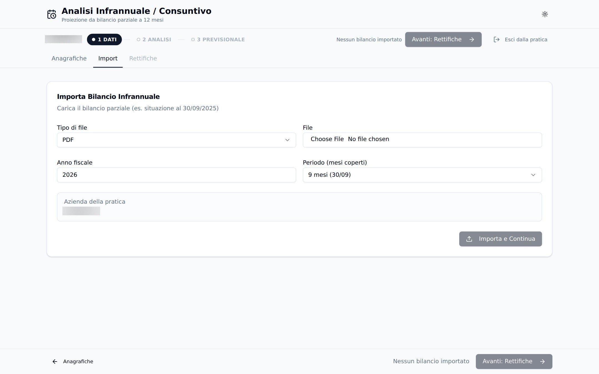

**Che cosa c'è a schermo**

- Il tipo di file: **XBRL**, **CSV** (formato TEBE), **PDF** (anche i PDF-scansione, dove l'OCR
  è attivo).
- L'azienda e **l'anno** di competenza, e la scelta del periodo: **anno intero** oppure
  **parziale da 1 a 11 mesi** (per esempio 6 = primo semestre). È la scelta che apre la strada
  all'infrannuale.
- L'esito, con la **quadratura** e gli **avvisi** (§ sotto).

**Come si fa.** 1) scegli tipo file e anno; 2) trascina il file; 3) leggi l'esito: se il
bilancio non quadra viene **importato comunque con un avviso**, non «aggiustato» in silenzio;
4) gli avvisi ti mandano alle Rettifiche, che è il posto dove si corregge.

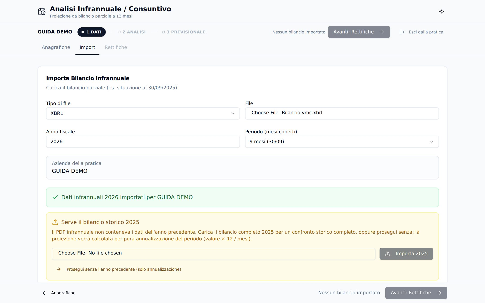

**Che cosa dichiara l'esito.** Attivo = passivo, il totale di CE che quadrà con l'utile in
stato patrimoniale, e gli scarti **misurati e non tappati** (un divario fra aggregato e dettagli,
una riga non riconosciuta): tutto diventa riga da correggere in Rettifiche, mai un importo
inventato. Un **parziale** e un **annuale** dello stesso anno coesistono di proposito: l'app
sceglie quale leggere a seconda dello schermo, e tu non devi cancellare l'uno per importare
l'altro.

**Attenzione a**

- Un file che non è un bilancio (un riepilogo di poche righe, un foglio export) viene
  **rifiutato con un errore**: è il comportamento giusto, non un guasto.
- L'import PDF non è deterministico: lo stesso file può quadrare in modo diverso a due esecuzioni.
  Un sospetto si conferma rieseguendo, mai su una prova sola.

**Approfondisci** → [REGOLE-IMPORT-00-INDICE.md](import/REGOLE-IMPORT-00-INDICE.md)

## 3. Rettifiche

`/pratica` → tab *Rettifiche* — una scheda **per anno** (storico + bilancio di verifica), da
confermare prima di proseguire

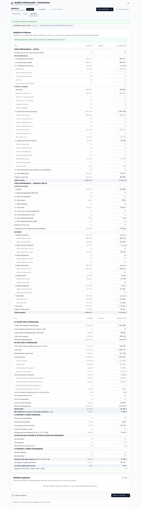

**A che cosa serve.** È l'unico posto dove **tu** correggi i numeri importati. Tutto ciò che sta
a valle legge il giornale: l'app non ha una «versione sistemata» nascosta da qualche parte.

**Che cosa c'è a schermo**

- I fogli per anno con l'etichetta «confermata», e **«Conferma rettifiche»** che sblocca il
  resto del percorso: *«Conferma le rettifiche per sbloccare gli step successivi. Se il bilancio
  non quadra puoi confermare lo stesso: l'avviso resta.»*
- Le griglie SP e CE con la colonna **Rett.** (il giornale applicato) e il totale live con la
  verifica di quadratura.
- Il dialogo **«Registra Rettifica»** con tre modalità — **«Rettifica (SP ↔ CE)»**,
  **«Riclassifica (stessa sezione)»**, **«Correggi Import»** — la riga modificata con il suo
  **+importo**, la **contropartita** a tendina e l'importo su di essa, e il conteggio
  «Rettifiche registrate: N / 20».

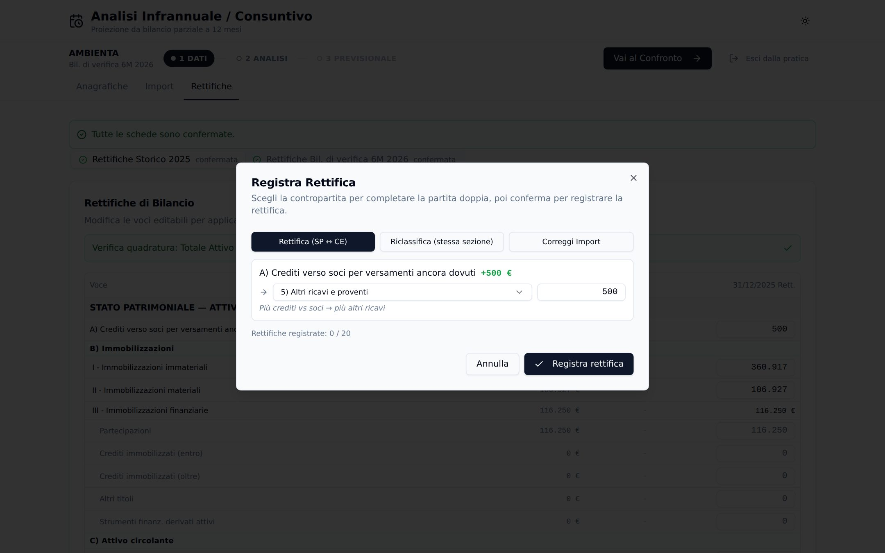

**Esempio.** La figura mostra una rettifica in partita doppia pronta da registrare: +500 € su
«Crediti verso soci per versamenti ancora dovuti», contropartita «Altri ricavi e proventi» 500 €.
Il dialogo stesso riassume il movimento («Più crediti vs soci → più altri ricavi»): dare e avere
sono lo stesso importo e il bilancio quadra come prima; ma qui la contropartita sta nel **CE**,
e con 500 € di altri ricavi si muovono anche il risultato d'esercizio e il patrimonio netto.
È il movimento giusto per un componente mai registrato (la più comune: una fattura da ricevere
non registrata, servizi ↔ debiti verso fornitori). Se vuoi solo spostare una voce senza toccare
i totali c'è **«Riclassifica (stessa sezione)»**: muovi una voce fra due voci della stessa sezione; **«Correggi Import»** è la partita semplice (un campo solo) per errori
dell'importatore.

**Attenzione a**

- **Massimo 20 rettifiche** per giornale: *«Massimo 20 rettifiche. Eliminane qualcuna per
  aggiungerne altre.»*
- Il server **rifiuta una rettifica che peggiora** sbilancio, identità CE↔utile o coerenza
  aggregati/dettagli; se invece il file era già storto dall'import, la correzione passa.
- I campi-aggregato (i totali) non sono editabili: si correggono i dettagli e il totale si
  ricostruisce da loro.

**Approfondisci** → [RETTIFICHE.md](frontend/RETTIFICHE.md)

---

# FASE 2 · ANALISI

Si raggiunge con le Rettifiche confermate, **anche con un bilancio annuale**: le tab Confronto,
Indicatori e Stampa ci sono sempre. La tab **Proiezione** compare solo con un **periodo
parziale** (< 12 mesi) importato: è l'analisi del «non ancora chiuso», il parziale proiettato a
12 mesi contro l'ultimo anno pieno.

## 4. Confronto

`/pratica` → tab *Confronto*

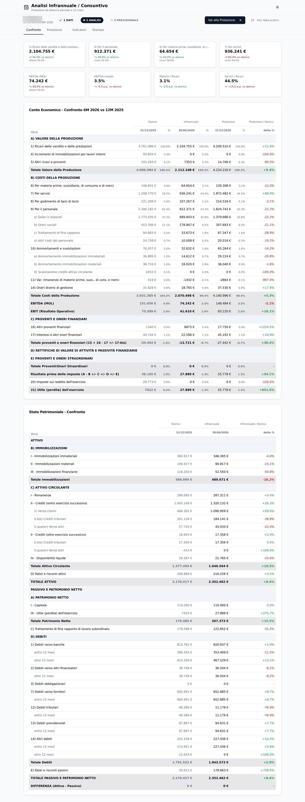

**A che cosa serve.** Righe accanto: il parziale contro l'anno di riferimento, con le variazioni.
È la lettura preliminare, **di sola lettura**.

**Che cosa c'è a schermo**

- Il **Conto Economico** annualizzato: il periodo × 12 / mesi, riga per riga, con delta e
  variazione %.
- Lo **«Stato Patrimoniale - Confronto»**: un'istantanea a fine periodo, **non annualizzata** —
  è una fotografia, non un flusso.

**Come si fa.** 1) guardi dove il periodo corre più dell'anno di riferimento (ricavi, costo del
personale, EBITDA); 2) le percentuali che vedi qui sono le stesse che il motore userà per la
proiezione — ma per cambiarle non sei qui: si cambiano in **Proiezione**.

**Approfondisci** → [REGOLE-IMPORT-05-INFRANNUALE.md](import/REGOLE-IMPORT-05-INFRANNUALE.md)

## 5. Proiezione

`/pratica` → tab *Proiezione*

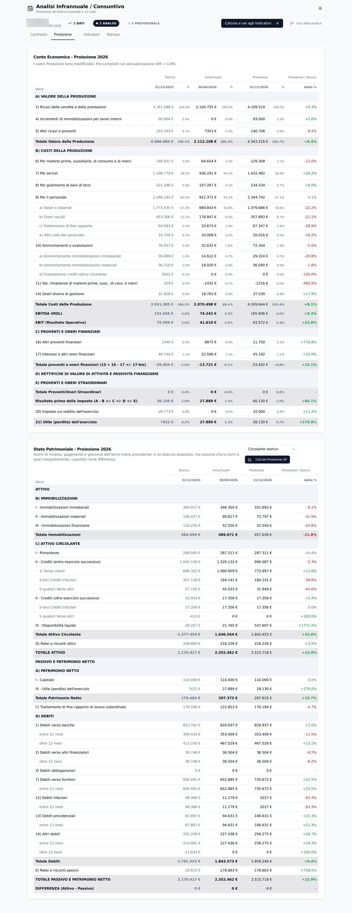

**A che cosa serve.** Qui il parziale diventa anno pieno: 22 righe di conto economico che puoi
digitare a mano, e uno stato patrimoniale proiettato che **il server** adatta di conseguenza.

**Che cosa c'è a schermo**

- La griglia CE modificabile con i subtotali che si aggiornano mentre digiti (valore della
  produzione, costi, MOL, EBIT, risultato ante e poste imposte, utile).
- **«Genera proiezione e indicatori di crisi»**: salva le ipotesi, fa rigenerare il motore e
  rilegge. Non c'è un secondo calcolatore a schermo: proiezione, indicatori e stampa leggono
  **lo stesso risultato**.
- Il modo del circolante: *storico* (i giorni dell'anno di riferimento — default),
  *infrannuale* (i giorni osservati nel periodo), *equilibrio* (cerca i giorni che chiudono la
  cassa a zero).
- Lo stato patrimoniale proiettato sotto.

**Attenzione a**

- Gli ammortamenti sono **annualizzati**, mai «cresciuti».
- Il debito finanziario viene riportato dal parziale così com'è: **non ruota** coi ricavi; solo
  il residuo operativo ruota sui ratio dell'anno di riferimento.
- Un fabbisogno di cassa scoperto qui **non** blocca la proiezione: esce come diagnosi di errore
  e lo scenario non è promuovibile finché non aggiungi una copertura (ipotesi o rettifica).

**Approfondisci** → [REGOLE-IMPORT-05-INFRANNUALE.md](import/REGOLE-IMPORT-05-INFRANNUALE.md) §5-bis

## 6. Indicatori

`/pratica` → tab *Indicatori*

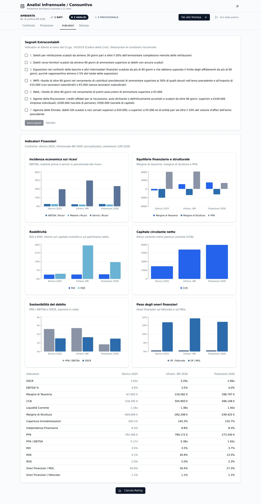

**A che cosa serve.** Le stesse schede KPI dell'analisi annuale (§ 14) calcolate sulla colonna
proiettata, più i **segnali di allarme della crisi d'impresa**.

**Che cosa c'è a schermo**

- Gli indici (redditività, solidità, liquidità) sulla proiezione.
- I **15 indicatori della crisi** in tabella, verde/ambra/rosso: 14 concorrono al punteggio,
  l'ultimo (incidenza oneri finanziari sui ricavi) è informativo. Indicatori, punteggio e classe
  (A3→D) li calcola il server; la schermata conta i segnali.
- I due grafici, che sono lo stesso componente della Stampa.

**Approfondisci** → [INDICATORI-E-STAMPA.md](frontend/INDICATORI-E-STAMPA.md)

## 7. Stampa

`/pratica` → tab *Stampa*

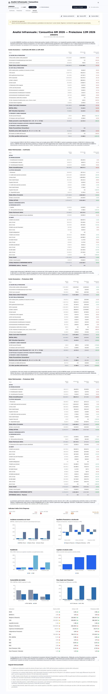

**A che cosa serve.** Il documento infrannuale vero: 13 pagine con copertina e indice (sintesi,
CE, costi, SP, circolante, debito, crisi d'impresa, segnali, allegati A/B), generato dal server.

**Che cosa c'è a schermo**

- L'anteprima a schermo, i **sei commenti AI** (generati e poi editabili), e le note chiudibili:
  una nota chiusa sparisce dal PDF ma il testo resta a schermo, e il commento si può riaprire.
- In alto a destra, **«Prosegui al Budget»**: crea lo scenario con l'anno di questa pratica e
  apre il wizard (§ 8); su un periodo parziale promuove prima la proiezione a bilancio annuale.
- **«Scarica PDF»** — il pulsante che conta: produce lo stesso documento del server, non la
  pagina del browser. **«Scarica Word»** esporta lo stesso report in `.docx` per ritoccare i testi.

**Attenzione a**

- La stampa del browser è un'anteprima: per consegnare il documento usa «Scarica PDF».
- I commenti AI hanno sei chiavi precise: un settimo commento aggiunto altrove viene **scartato
  in silenzio**. Un commento *chiuso* sparisce dal PDF ma il testo resta a schermo.

**Approfondisci** → [REPORT-INFRANNUALE-PDF.md](budget/REPORT-INFRANNUALE-PDF.md)

---

# FASE 3 · PREVISIONALE

Le tab dentro la pratica sono cinque: **Budget** (il wizard), **CE Prev.**, **SP Prev.**,
**Rendiconto**, **Report**. Le altre due pagine del previsionale — **Indici** (§ 14) e
**Riclassificato** (§ 11) — si aprono dal menu **«Previsionale»** della barra di navigazione in
alto, non sono tab di questo percorso.

## 8. Il wizard in 7 passi

`/budget` (o la fase PREVISIONALE della pratica) — «Crea un nuovo scenario» o «Modifica» su una
scheda scenario. L'ingresso è sempre il **passo 1**; da lì i sette passi in alto: Scenario ·
Fatturato · Costi · Capitale circolante · Patrimoniale pregresso · Patrimoniale piano · Imposte.

**Come funziona un passo.** A sinistra le ipotesi, a destra l'**anteprima dal vivo**: il pannello
del motore che si aggiorna mentre digiti e **non scrive nulla**. Niente di ciò che tocchi esiste
per il server finché non premi **«Salva e Calcola Previsionale»**.

### Passo 1 · Scenario

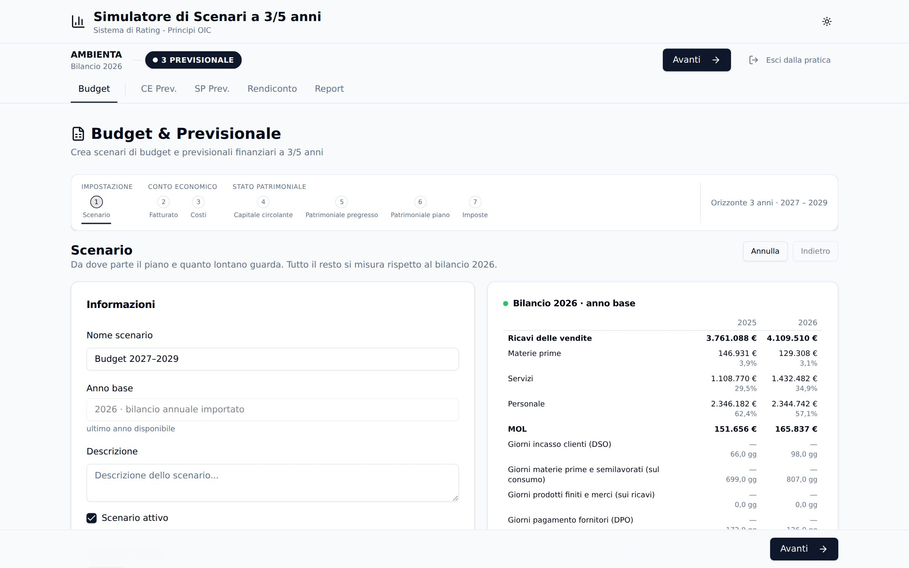

**Che cosa c'è a schermo**

- **«Nome»**, l'**anno base** — non è a scelta: un campo non modificabile con l'ultimo bilancio
  annuale importato («2026 · bilancio annuale importato», fra l'altro segnato «ultimo anno
  disponibile») — e l'orizzonte: **«3 anni» / «5 anni»** più il campo numerico.
- Il riquadro **«Punto di partenza»** con **«Inflazione attesa»** e la tabella **«Tendenza»**,
  che per ricavi, altri ricavi, materie prime, servizi, godimento beni di terzi, personale e
  oneri diversi mostra la variazione % fra gli ultimi due anni annuali.
- A destra, il riepilogo dell'anno base con i giorni storici (DSO/DIO/DPO) e la struttura dei
  costi: è da qui che il motore parte.

**Che cosa fa l'inflazione.** **Non tocca i ricavi.** Precompila la crescita della sola **parte
fissa** di materie prime e servizi al passo 3 (puoi correggerla lì).

**Attenzione a.** Accorciare l'orizzonte non lascia anni fantasma: già al primo «Salva e calcola
previsionale» le ipotesi degli anni tolti vengono cancellate, insieme ai loro anni di
proiezione — la schermata lo avvisa con queste parole.

### Passo 2 · Fatturato

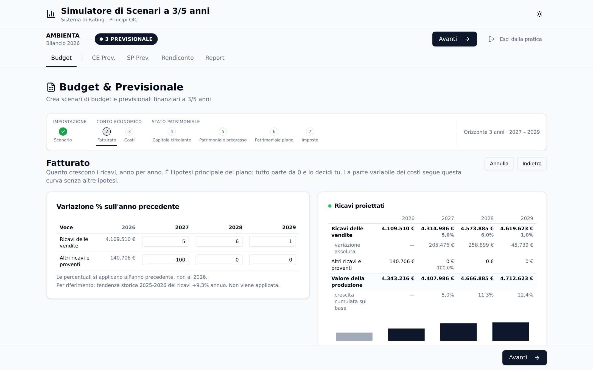

**Che cosa c'è a schermo**

- Il riquadro **«Variazione % sull'anno precedente»**: una riga **«Ricavi delle vendite»** e una
  **«Altri ricavi e proventi»** per ogni anno di piano — «Le percentuali si applicano all'anno
  precedente, non al 2026».
- A destra l'anteprima **«Ricavi proiettati»**: riga per riga, con la barra dei ricavi.

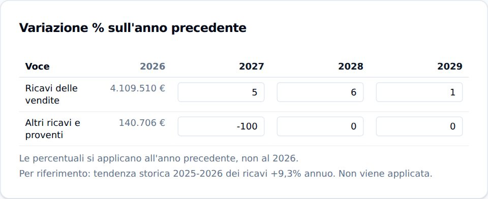

**Esempio (AMBIENTA, ricavi 2026 = 4.109.510 €).** Con +5% nel 2027 l'anteprima dà ricavi
**4.314.986 €** (+205.476 €); portando quella cella a +7,5% diventano **4.417.723 €**
(+308.213 €) e tutto il resto del piano si riposiziona: la crescita si compone anno su anno,
quindi il +6% del 2028 lavora sui 4,42 milioni nuovi, non sui 4,31 vecchi.
L'incremento di magazzino è già stimato con i ricavi al passo 4.

**Attenzione a.** Una cella vuota non vale zero: è «non dichiarato», e il motore usa il suo
default. E se la riga è stata forzata in **CE Previsionale** (§ 9), sotto la tabella compare
«prevale l'importo fissato in CE Prev.; la percentuale non viene applicata»: lì la crescita non
fa nulla finché non liberi l'override (pulsante «Usa la percentuale»).

### Passo 3 · Costi

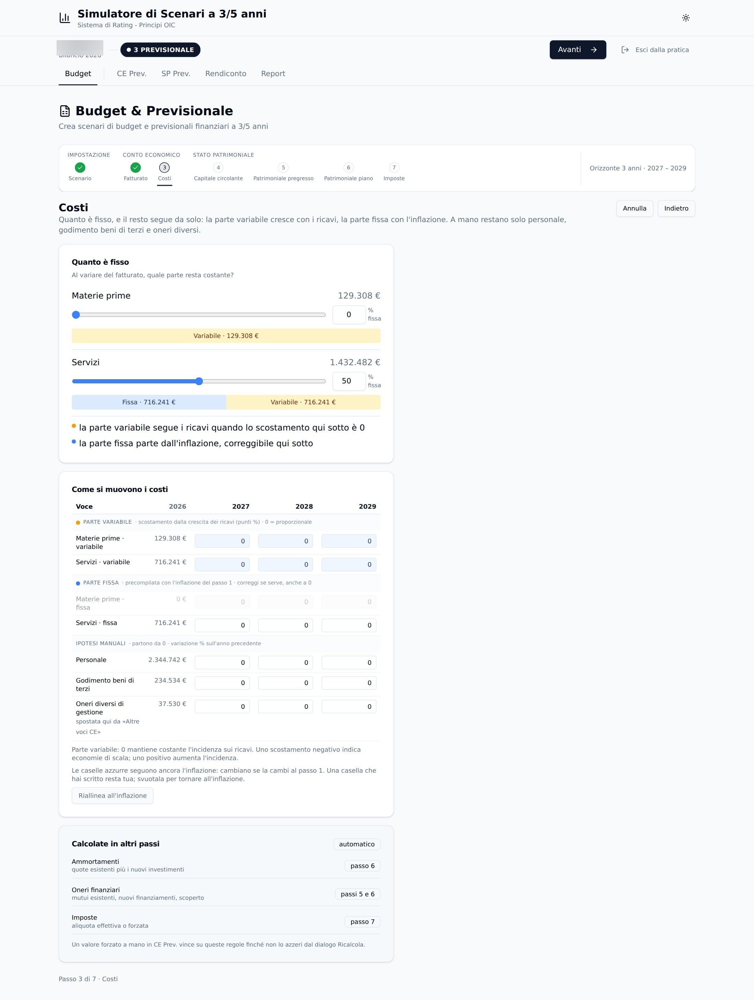

**Che cosa c'è a schermo**

- **«Quanto è fisso»**: per **Materie prime** e **Servizi** uno slider con la % fissa e la barra
  che mostra i due importi.
- **«Come si muovono i costi»**: la tabella **«Parte variabile»** (scostamento dalla crescita dei
  ricavi in punti %, 0 = proporzionale), la **«Parte fissa»** (precompilata con l'inflazione del
  passo 1) e le **«Ipotesi manuali»** — Personale, Godimento beni di terzi, Oneri diversi — con
  la variazione % per anno. Il pulsante **«Riallinea all'inflazione»** rimette
  la parte fissa sul valore dell'inflazione.
- **«Calcolate in altri passi»**: ammortamenti (passo 6), oneri finanziari (passi 5 e 6),
  imposte (passo 7) — qui non si toccano.

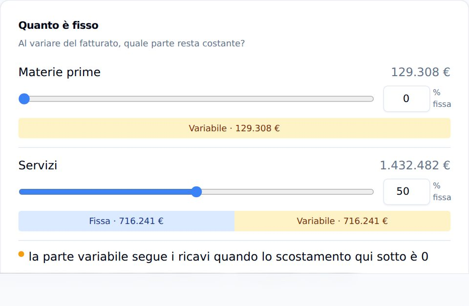

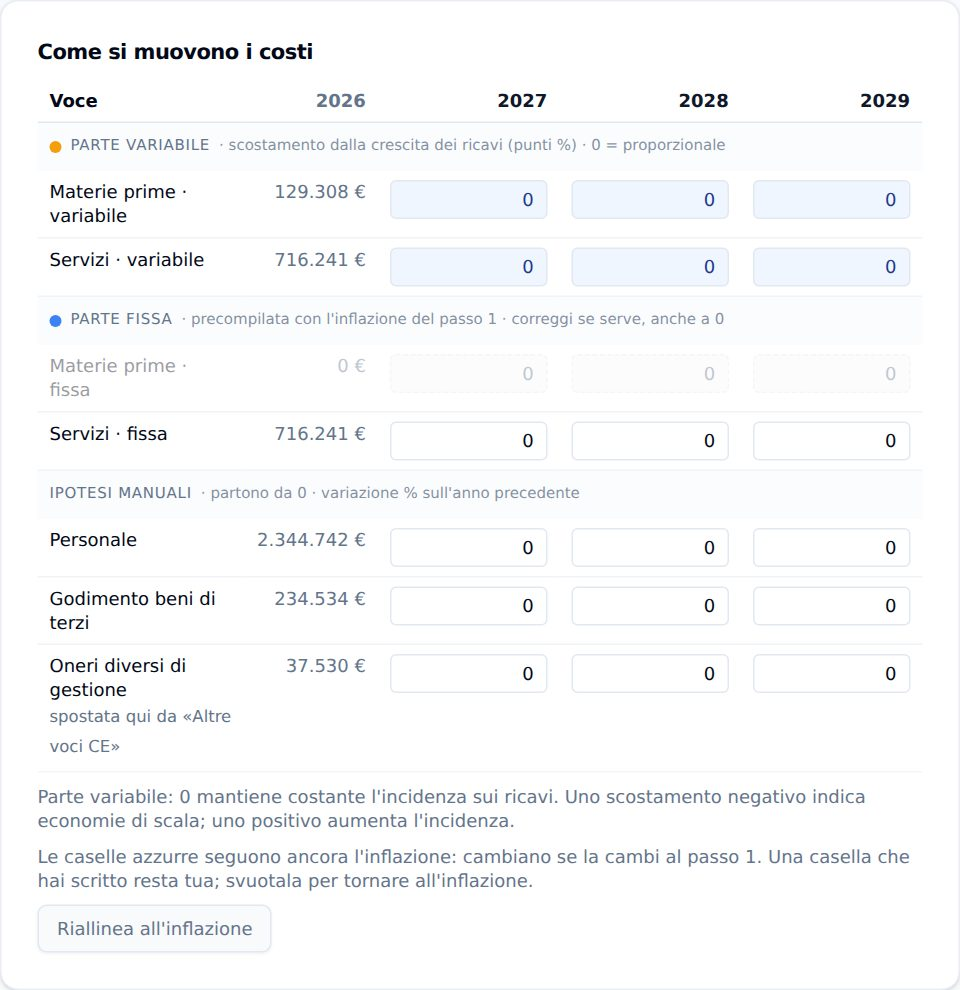

**Esempio (servizi 2026 = 1.432.482 €, quota fissa salvata 50%).** Con il 50% l'anteprima dà
«servizi · quota variabile» 2027 = **752.053 €** e il totale variabile (materie + servizi)
**887.826 €**, il 20,6% dei ricavi. Alzando lo slider a **100%** la parte variabile dei servizi
va a zero: la quota variabile scende a **0 €** e il totale variabile 2027 a **135.773 €**
(3,1%) — tutto il costo dei servizi cresce ora con l'inflazione, non più coi ricavi. È la leva
giusta per capire quanto il margine del piano dipende dal volume.

**Attenzione a.** La % fissa è **una sola e vale per tutti gli anni** (il modello è per anno,
l'interfaccia no): se uno scenario ha valori diversi fra anni la schermata avvisa e allinea al
primo tocco. Un valore forzato a mano in CE Prev. (§ 9) vince su tutte queste regole finché non
lo azeri dal dialogo Ricalcola.

**Approfondisci** → [FORECASTING_GUIDE.md](budget/FORECASTING_GUIDE.md)

### Passo 4 · Capitale circolante

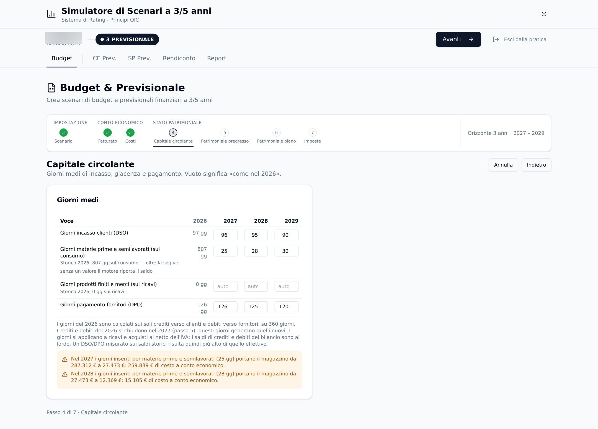

**Che cosa c'è a schermo**

- **«Giorni medi»** per anno: **DSO** (incasso clienti), **DIO** in due gruppi —
  materie/semilavorati (sul consumo) e prodotti finiti/merci (sui ricavi) — **DPO** (pagamento
  fornitori): quattro righe, una colonna per anno di piano; le altre voci minori sono governate
  dai passi 5 e 6, non dai giorni.
- L'anteprima **«Capitale Circolante Commerciale»**: Crediti commerciali, rimanenze, debiti verso
  fornitori, CCN e — la riga che interessa — **«cassa liberata (+) / assorbita (−) dal
  circolante»**.

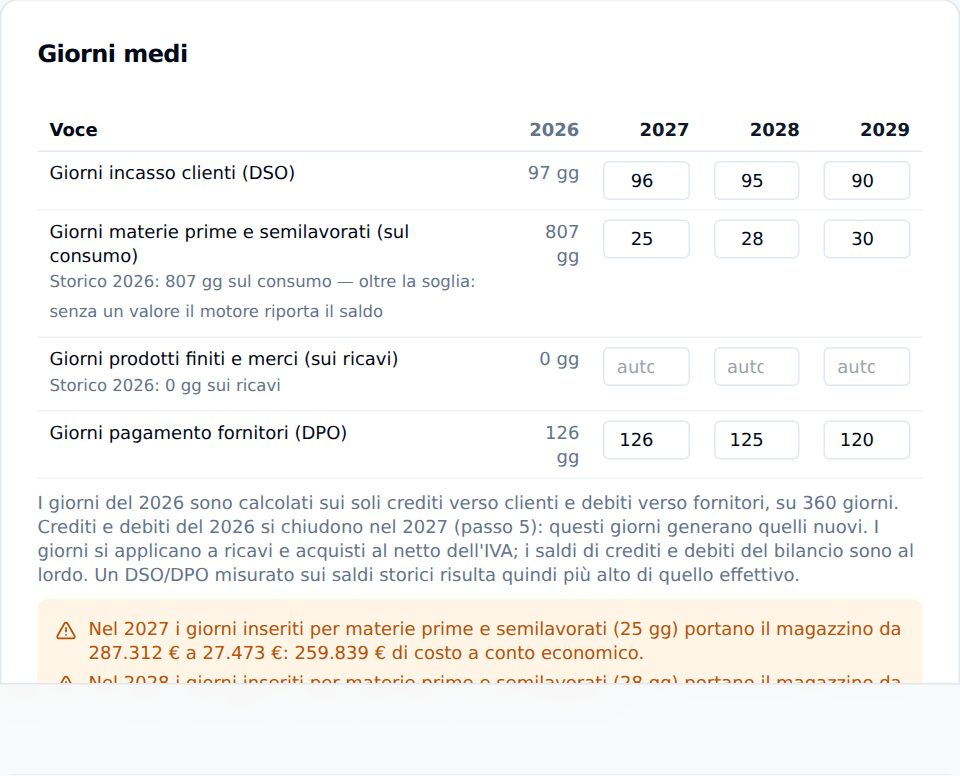

**Esempio (DSO 2027: da 96 a 60 giorni).** I crediti commerciali 2027 passano da **1.155.663 €**
a **724.164 €**, la «cassa liberata» 2027 da +227.248 € a **+658.747 €**. Ma attenzione al 2028:
i giorni 2028 restano 95 e l'incasso straordinario del 2027 si **rovescia** in un assorbimento di
**−458.688 €**. Un giorno medio modificato in un solo anno è una decisione *una tantum*, non una
politica di cassa: se vuoi che duri, metti gli stessi giorni su tutti gli anni.

**Attenzione a.** Se i giorni di un anno hanno un denominatore non positivo (ricavi o consumi a
zero) o implicano oltre un anno di rotazione, il valore è **scartato**: il motore riporta lo
stock dell'anno base e l'anteprima lo dichiara con l'avviso. Non è un bug, è il guard-rail.

### Passo 5 · Patrimoniale pregresso

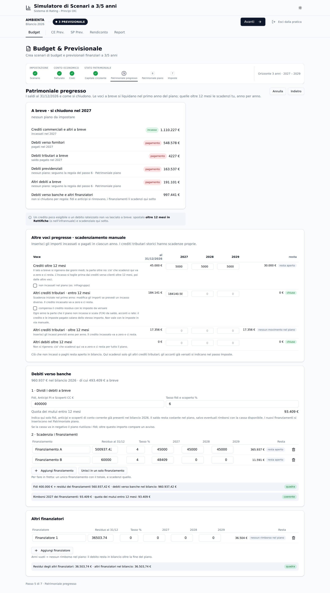

**A che cosa serve.** Che fine fanno i saldi **già in bilancio al 31/12 dell'anno base**: il
lato breve si chiude nel primo anno di piano, quello oltre 12 mesi lo scandenzi tu.

**Che cosa c'è a schermo**

- **«A breve · si chiudono nel 2027»**: le righe con «incasso/pagamento» dell'anno 1 (crediti
  commerciali, fornitori, tributari a breve, previdenziali, altri debiti) e i loro importi.
- **«Altre voci pregresse · scadenziamento manuale»**: **quattro** righe —
  crediti oltre 12 mesi; altri crediti tributari entro 12 mesi; altri crediti tributari oltre 12
  mesi; altri debiti oltre 12 mesi — con una casella per anno, il «resta» e l'etichetta «resta
  aperto» / «chiuso». Sotto la riga tributaria a breve c'è la casella **«compensa il credito
  residuo con le imposte da versare»**.
- **«Debiti verso banche»**: «1 · Dividi i debiti a breve» (fidi/anticipi con
  tasso, e la «quota dei mutui entro 12 mesi» che ne deriva) e «2 · Scadenzi i finanziamenti»
  (una riga per finanziamento pregresso: residuo, tasso, rata per anno, «Resta» + «resta
  aperto»). I due controlli in fondo: *fidi + residui dei finanziamenti = debiti verso banche a
  bilancio* (**quadra**), *rimborsi primo anno = quota mutui entro 12 mesi* (**coerente**).
- **«Altri finanziatori»**, stessa forma.

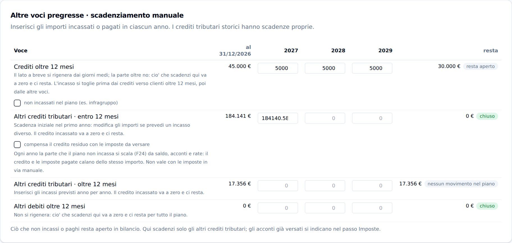

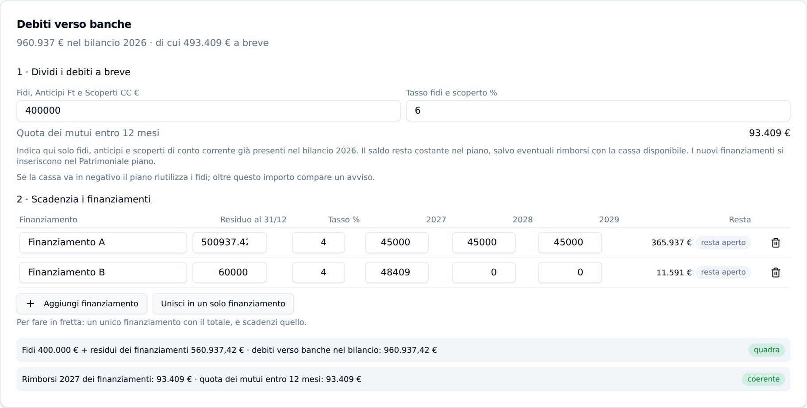

**Esempio (AMBIENTA).** Debiti verso banche 2026 = **960.937 €**, «di cui 493.409 € a breve»:
fidi 400.000 € (tasso 6%) + 93.409 € di rate 2027 dei due finanziamenti. Il credito oltre 12
mesi da 45.000 € scandenziato a 5.000 €/anno chiude il piano con **30.000 € «resta aperto»** —
li riproietti anche nel 2030, se esisti ancora.

**Attenzione a.** Un anno forzato in **via manuale** (passo 6) non può scaricare meno di quanto
il piano tributario ripartirà l'anno dopo, o la stessa rata uscirebbe due volte: il motore lo
rifiuta con un errore che nomina l'anno e le tre vie d'uscita. E un residuo oltre 12 mesi che
non scandenzi **non sparisce**: resta in bilancio per tutto il piano.

**Approfondisci** → [API-PREVISIONALE.md](budget/API-PREVISIONALE.md)

### Passo 6 · Patrimoniale piano

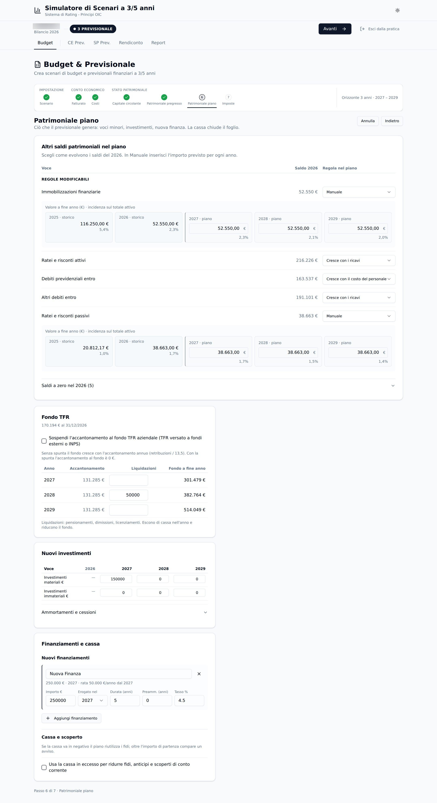

**A che cosa serve.** Che cosa il piano **genera**: investimenti, nuovi finanziamenti, fondo
TFR, altri saldi. La cassa chiude il foglio.

**Che cosa c'è a schermo**

- **«Altri saldi patrimoniali nel piano»**: tendina per voce — *Cresce con i ricavi*, *Cresce
  con gli acquisti (materie e servizi)*, *Cresce con il costo del personale*, oppure *Manuale*
  (e allora compaiono gli importi per anno, con lo storico a sinistra non editabile) — e i
  «Saldi a zero nel 2026» raccoglitore.
- **«Fondo TFR»**: saldo iniziale, casella per sospendere l'accantonamento (TFR a fondi esterni),
  riga per anno: accantonamento (calcolato), **liquidazioni** (le inserisci tu), fondo a fine
  anno. Le liquidazioni **oltre il fondo disponibile si rifiutano**, non si riducono.
- **«Nuovi investimenti»**: importi per anno, materiali e immateriali;
  «Ammortamenti e cessioni» raccoglitore con le aliquote. Un cespite nuovo ammortizza a **metà
  aliquota** nell'anno di entrata.
- **«Finanziamenti e cassa → Nuovi finanziamenti»**: nome, Importo, anno di erogazione, durata,
  preammortamento, tasso. **«Cassa e scoperto»**: «Usa la cassa in eccesso per
  ridurre fidi, anticipi e scoperti di conto corrente» (sweep) con **«Cash sweep: cassa minima €»**,
  e la concessione dello **scoperto di conto corrente** — **non concesso** di default: un fabbisogno
  senza rimedio fa **fallire la generazione** con un errore, invece di inventare un numero.

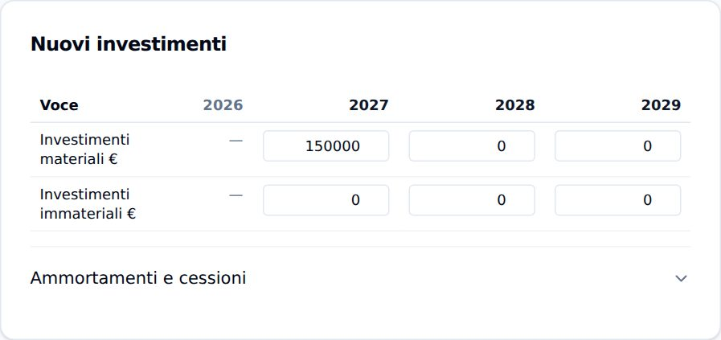

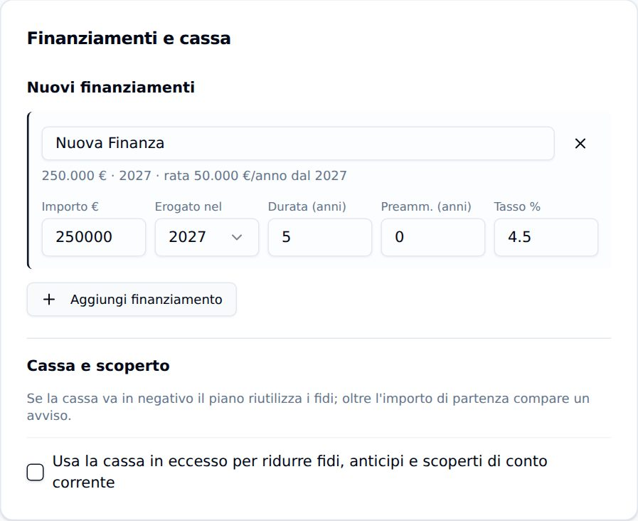

**Esempio (AMBIENTA: «Nuova Finanza», 250.000 € erogati nel 2027, 5 anni, tasso 4,5%).** La
scheda stessa dice «rata 50.000 €/anno dal 2027»; nell'anteprima «Debito, cassa e PFN» il nuovo
prestito residua **200.000 €** a fine 2027, 150.000 € nel 2028, 100.000 € nel 2029 — e la rata
che scade l'anno dopo sta **già** dentro i debiti bancari a breve dello SP Prev. (non resta
tutta oltre i 12 mesi: sarebbe un errore che il pareggio attivo = passivo non vede, ma che
falsa circolante e indici di liquidità). La cassa 2027 dell'anteprima (295.408 €) parte anche da
lì.

**Approfondisci** → [FORECASTING_GUIDE.md](budget/FORECASTING_GUIDE.md)

### Passo 7 · Imposte

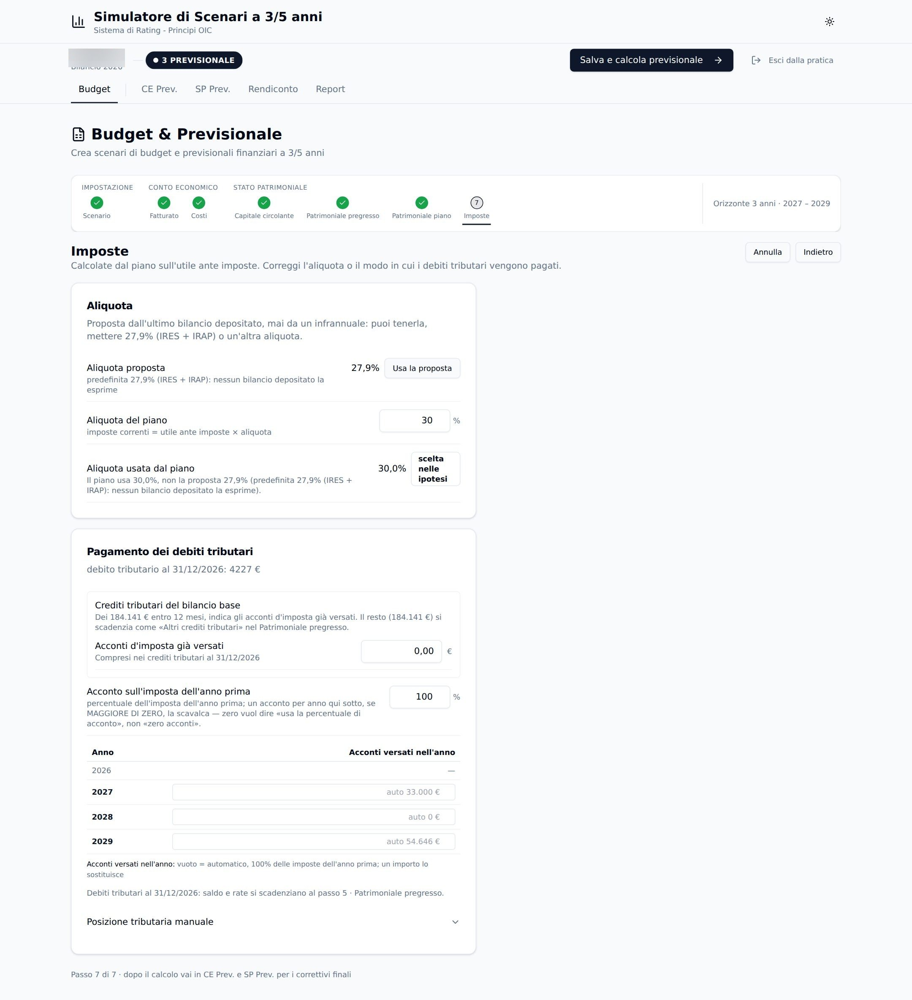

**Che cosa c'è a schermo**

- **«Aliquota»**: proposta dall'**ultimo bilancio annuale depositato** (mai da
  un infrannuale, mai da una proiezione); 27,9 = IRES+IRAP quando non è derivabile o esce sopra
  60. L'aliquota si applica **così com'è**: la cambi tu se la vuoi diversa.
- **«Pagamento dei debiti tributari»**: la regola di cassa — ogni anno si paga
  il **saldo** dell'anno prima + gli **acconti** dell'anno; l'acconto è per default 100%
  dell'imposta dell'anno prima, o l'importo esplicito se **maggiore di zero** (zero nella
  casella = «non dichiarato», e si torna alla percentuale).
- L'anteprima fiscale: risultato ante imposte, imposte, utile, debiti tributari a fine anno, e i
  **pagamenti dell'anno** riga per riga (saldo versato, acconti, credito compensato, uscita di
  cassa).

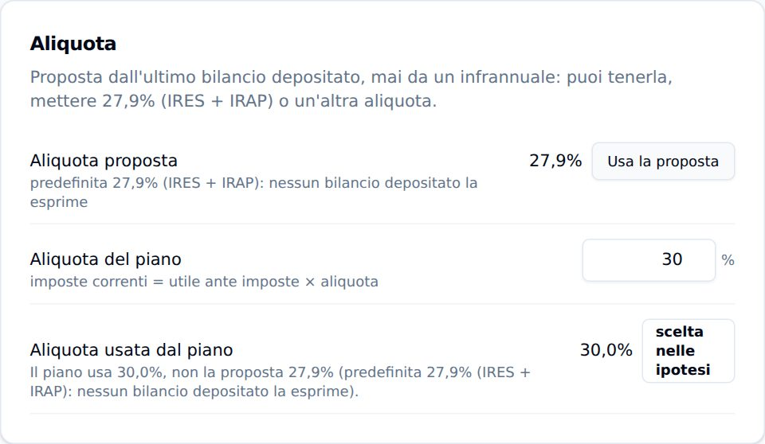

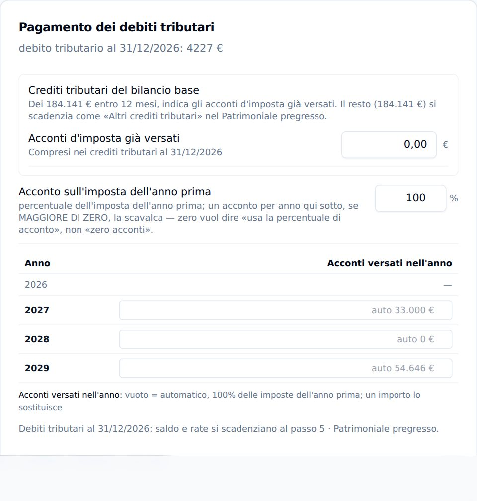

**Esempio (AMBIENTA).** Nel 2027 l'uscita di cassa per imposte è **37.227 €**: saldo 2026
**4.227 €** + acconto 2027 **33.000 €**, versati in un colpo solo. Nel 2028 l'uscita è
**−33.000 €**: il primo anno di piano chiude in perdita, quindi non c'è saldo da pagare e
l'acconto versato l'anno prima torna indietro come credito compensato; non a caso l'«acconto
auto» del 2028 in anteprima è **0 €**: l'acconto di default è il 100% dell'imposta dell'anno
prima, e quella del 2027 è zero. Nel 2029 si pagano saldo + acconto del 2028: **109.291 €**. Se
l'aliquota proposta non ti convince la cambi: si applica così com'è.

**Approfondisci** → [API-PREVISIONALE.md](budget/API-PREVISIONALE.md) §4

### Il pulsante finale: «Salva e Calcola Previsionale»

Il salvataggio che produce il previsionale. Due verità che vale sapere:

- Un previsionale **rifiutato** (per esempio: *«Fabbisogno finanziario scoperto di … €:
  aggiungi un'ipotesi di finanziamento esplicita; nessun debito bancario è stato creato
  automaticamente.»*) risponde comunque «ok» al salvataggio: le ipotesi restano
  salvate e **la ragione arriva nel toast** — nel wizard a 7 passi è un errore che ti riporta
  anche al passo che lo ha causato, nel modulo Startup un avviso giallo. Se il toast dice
  «Previsionale calcolato» il calcolo c'è.
- Dal dialogo **«Ricalcola»** (pulsante omonimo sulla lista scenari) puoi azzerare le modifiche
  manuali del CE: la casella **«Azzera le modifiche manuali del CE previsionale»** cancella solo
  quelle, **non** gli override dello SP Prev.

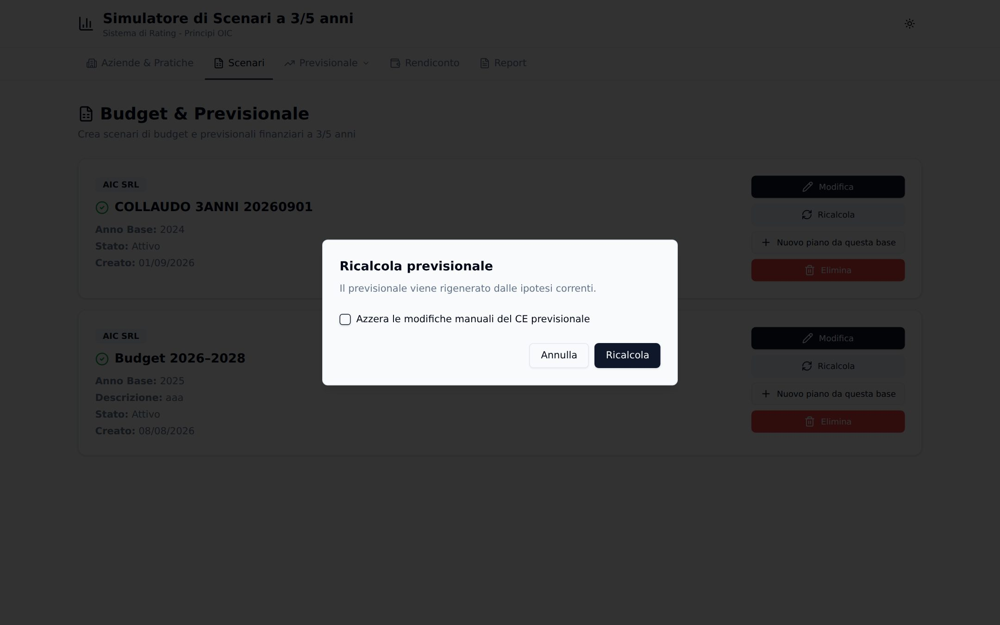

## 9. CE Previsionale

`/forecast/income`

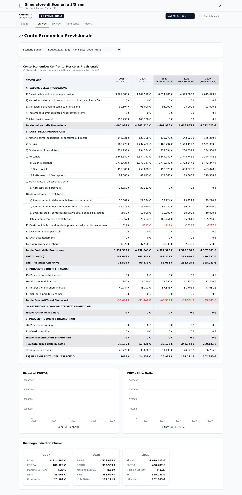

**A che cosa serve.** Guardare e correggere il conto economico di piano **cella per cella**: le
percentuali del wizard sono già diventate importi, e qui puoi forzarli.

**Che cosa c'è a schermo**

- La griglia «Conto Economico: Confronto Storico vs Previsionale» con le colonne STORICO/PREVISIONALE;
  *«Clicca sulle celle previsionali per modificarle, poi "Aggiorna Previsionale"»*.
- Una cella modificata appare diversa (bordo e freccia) e resta tale anche ricaricando la pagina;
  **«Ripristina tutte le forzature»** le azzera in blocco.
- Sotto: ricavi/EBITDA, EBIT/utile, il riepilogo indici per anno.

**Esempio.** Forzando «Ricavi delle vendite» 2027 a **4.500.000 €** (figura sotto), il 2027
diventa 4,5 milioni **e anche il 2028 si muove**: 4.770.000 € = il forzato × la crescita +6%
salvata, e il 2029 a 4.817.700 €. L'override è sopravvissuto a ogni «Salva e Calcola»
successivo: vince sulla percentuale e non si azzera da solo.

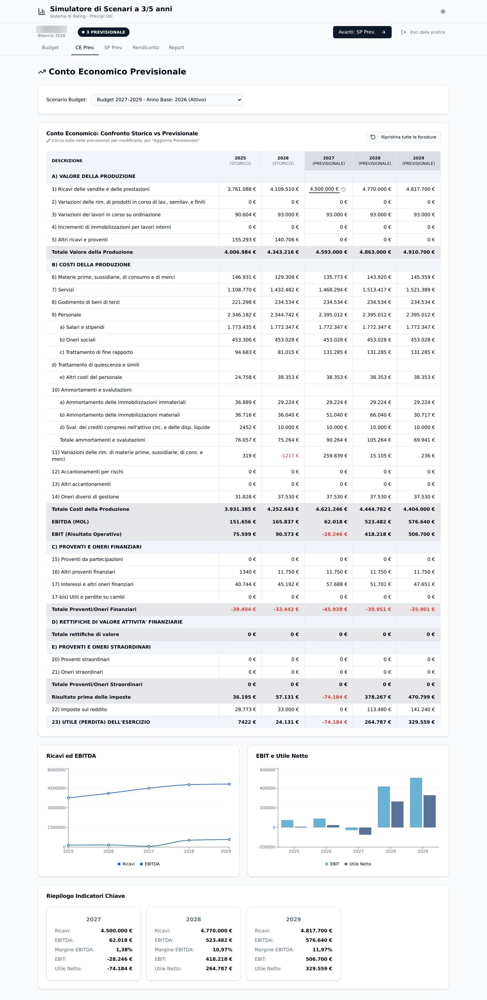

**Attenzione a.** L'override che il motore rifiuta — perché sbilancerebbe il foglio o perché la
riga è governata da un piano — **non viene salvato**: l'errore appare a schermo e la cella torna
com'era. Se il numero non cambia dopo una modifica, prima guarda se c'è un override attivo
altrove: dove la riga è forzata, «prevale l'importo fissato in CE Prev.; la percentuale non
viene applicata».

## 10. SP Previsionale

`/forecast/balance`

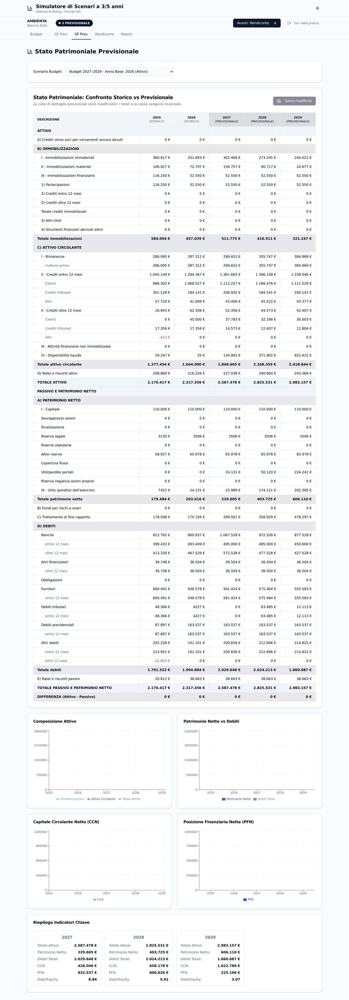

**A che cosa serve.** Lo stesso, per lo stato patrimoniale: le celle di dettaglio si forzano, i
totali e la cassa si ricalcolano («Le celle di dettaglio previsionali sono modificabili; i
totali e la cassa vengono ricalcolati»).

**Che cosa c'è a schermo.** La griglia SP storico vs previsionale, la stessa cassa che chiude il
foglio, e i controlli che il motore fa valere:

- Le righe **governate da un piano** (il pregresso che il passo 5 scadenzi) si **rifiutano**:
  l'override sopravviverebbe un anno e poi il piano lo cancellerebbe, con la cassa che assorbe
  la differenza senza alcun flusso. Il messaggio nomina la voce e il passo del wizard che la
  scadenzia; la via d'uscita è svuotare la cella.
- Un override **negativo** su una cella dello SP diventa uno **zero** senza lamentarsi, e una
  chiave scritta male (campo che non esiste) è **ignorata** in silenzio. Sullo stato
  patrimoniale è lecito; sul CE no (vedi § 9).
- Le righe **a giorni** (DSO/DPO) valgono **un anno solo**: dall'anno dopo tornano alla formula.
- Un override che squilibra il foglio **non** si chiude con cassa a zero: il fabbisogno viene
  misurato dopo l'override e, se lo scoperto non è concesso, la generazione viene rifiutata.

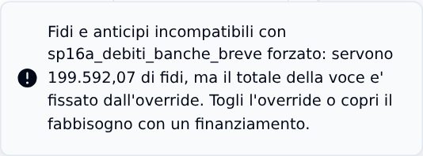

**Esempio.** Forzare a 0 il debito bancario a breve 2027, quando il piano prevede 199.592,07 €
di prelievo dai fidi, produce il rifiuto nella figura: l'override non viene salvato e il
foglio resta com'era. La via d'uscita è nel messaggio stesso (togli l'override, o finanzia il
fabbisogno).

## 11. Riclassificato

`/forecast/reclassified` — menu **«Previsionale»** della barra in alto (pagina di sola lettura)

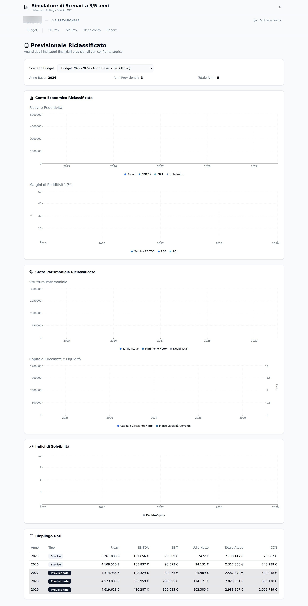

**Che cosa c'è a schermo.** Lo **stato patrimoniale riclassificato** (attivo/passivo/PN per
aree) anno per anno, e sotto la **finestra sugli indici**: solidità patrimoniale, copertura
delle immobilizzazioni, indici di liquidità e composizione delle fonti, con formula accanto al
valore. Dove il denominatore manca il valore è **n.d.**, mai zero.

**A che cosa serve.** Verificare la *struttura* del piano: dove sono le immobilizzazioni, quanta
parte è finanziata da mezzi propri, se il circolante regge. È la stessa riclassificazione che
trovi negli allegati del Report, ma interattiva.

## 12. Rendiconto

`/cashflow`

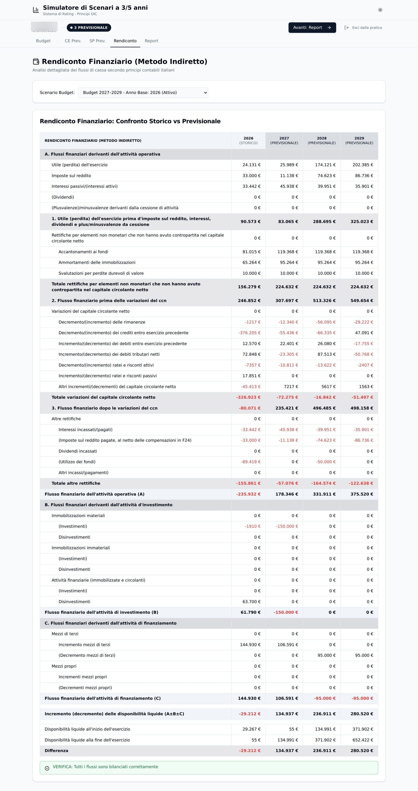

**Che cosa c'è a schermo.** Il rendiconto finanziario **metodo indiretto** (OIC): A) flussi
dall'attività operativa, B) attività di investimento, C) attività di finanziamento, e 1)
incremento/decremento di cassa, storico contro previsionale, con il controllo in fondo
(«Tutti i flussi sono bilanciati correttamente» — è un controllo, non una cortesia).

**Due scelte che si vedono nei numeri**

- Le **erogazioni** (finanziamenti nuovi, incluso il prelievo dai fidi) stanno in una riga
  separata dai **rimborsi**: il DSCR può usare la sola quota capitale contrattuale.
- Il debito finanziario **non passa dal circolante**: le variazioni dei debiti vanno in
  finanziamento, e il circolante prende gli aggregati al netto delle quote finanziarie.

**Approfondisci** → [FORECASTING_GUIDE.md](budget/FORECASTING_GUIDE.md) § rendiconto

## 13. Report — il Business plan

`/report`

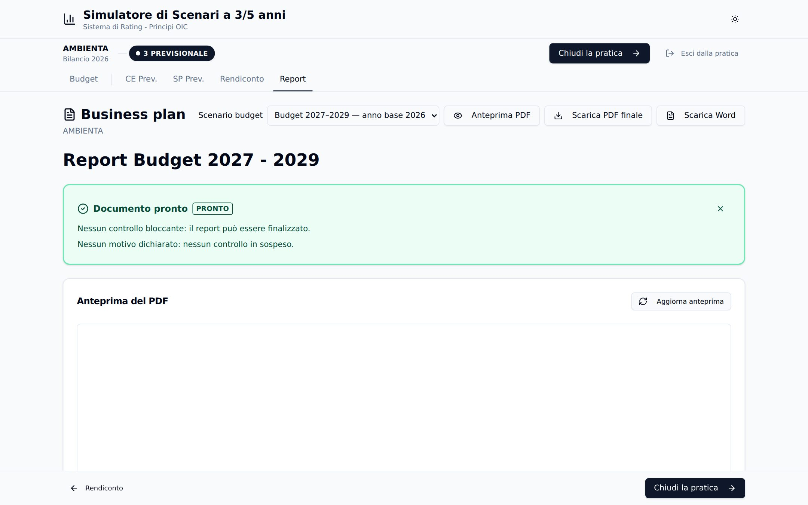

**A che cosa serve.** Il documento da consegnare: un PDF generato dal server (non
dalla pagina del browser) con copertina, indice e dieci sezioni — Sintesi del piano · Evoluzione
economica dell'impresa · EBITDA margin e struttura dei costi · Costi fissi e variabili e punto
di pareggio · Flussi di cassa · Sostenibilità del debito (DSCR e PFN) · Capitale circolante
commerciale · Solidità patrimoniale, liquidità e redditività · Punto di partenza · Assunzioni
del piano — più gli **Allegati A–E** (conto economico, stato patrimoniale e rendiconto
completi, indicatori di sintesi, indici analitici). Le pagine crescono con l'orizzonte del
piano: un 5 anni ne conta una in più dello stesso 3 anni.

**Che cosa c'è a schermo**

- Il selettore «Scenario budget», **«Anteprima PDF»**, **«Scarica PDF finale»** / **«Scarica
  bozza»** a seconda dello stato, **«Scarica Word»**.
- Il banner di stato: **«Documento pronto»**, oppure **«Documento bloccato»** con la motivazione
  (figura sotto) e, quando serve, **«Rigenera previsionale»**.
- In fondo, il riquadro chiuso **«Vista web del dossier»**: lo stesso documento in HTML con indice
  laterale e tabelle/grafici per sezione — va **aperto** cliccandolo. La sezione Fonti è la
  tracciabilità: ogni fonte con numero di revisione e data, così un numero del PDF si può sempre
  rispedire al file che l'ha prodotto.

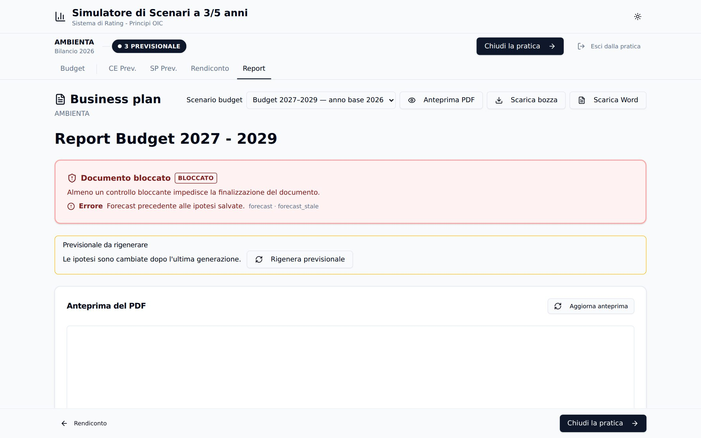

**Attenzione a.** Finché un controllo bloccante non si risolve il pulsante resta «Scarica
bozza»: la bozza ha gli stessi numeri, ma il documento dice di essere bozza.

**Approfondisci** → [BUSINESS-PLAN-PDF.md](budget/BUSINESS-PLAN-PDF.md)

## 14. Analisi finanziaria completa (Indici)

`/analysis` — menu **«Previsionale»** della barra in alto

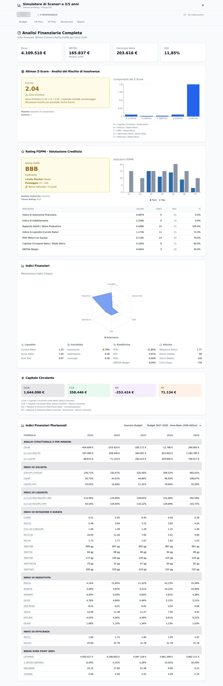

**A che cosa serve.** Il cruscotto sugli **indici di bilancio** della situazione selezionata:
le schede in alto (Ricavi, EBITDA, PN, ROE), **Altman Z-Score** con zona e componenti, **rating
FGPMI** (7 indicatori V1–V7 su soglie di settore, classe AAA→BB-), i grafici, e la tabella
pluriennale con la **formula di ogni indice** accanto al valore.

**Le scelte di perimetro che cambiano i numeri**

- Il **DSO** è sui soli crediti **commerciali**, non sull'aggregato: se il dettaglio non c'è
  l'indice è **n.d.**, non zero.
- Il **DIO** è sul **consumo di materie**; ROD e PFN sull'intero perimetro del debito
  finanziario, ROD sul **debito medio** fra inizio e fine anno.
- Il **CCN** è simmetrico sui ratei (attivo corrente: rimanze, crediti a breve, liquidità,
  ratei/risconti attivi; passivo corrente: debiti entro l'anno e ratei/risconti passivi).
- Un **n.d.** è una dichiarazione («non ho il dato per calcolarlo»), non un buco nell'app.

**Approfondisci** → [INDICATORI-E-STAMPA.md](frontend/INDICATORI-E-STAMPA.md)

## 15. Il percorso Startup

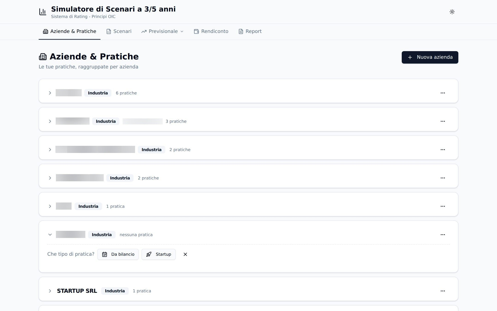

**A che cosa serve.** Fare un business plan **senza bilancio storico**: una start-up parte da
capitale sociale e driver economici.

**Che cosa c'è a schermo**

- «Nuovo business plan startup»: *«Una startup non ha un bilancio storico. Inserisci l'identità,
  il capitale di partenza e i driver economici attesi per ogni anno: le variabili economiche del
  previsionale vengono generate in automatico.»*
- **«Nome startup\*»**, **«Descrizione»**, **«Capitale sociale di partenza (€)\*»** («Conferito
  come liquidità: costituisce il patrimonio netto e la cassa dello stato patrimoniale di
  partenza.»), **«Periodo di piano»** 3/5 anni, e la tabella **«Driver economici attesi per
  anno»** (ricavi, costi, investimenti, finanziamenti anno per anno).

Dalla stessa scheda azienda della home: «Nuova pratica» → **Startup**. In alto lo stepper mostra
solo le fasi vere (1 DATI → 3 PREVISIONALE): le ANALISI infrannuale non ci sono, non c'è un
bilancio da confrontare.

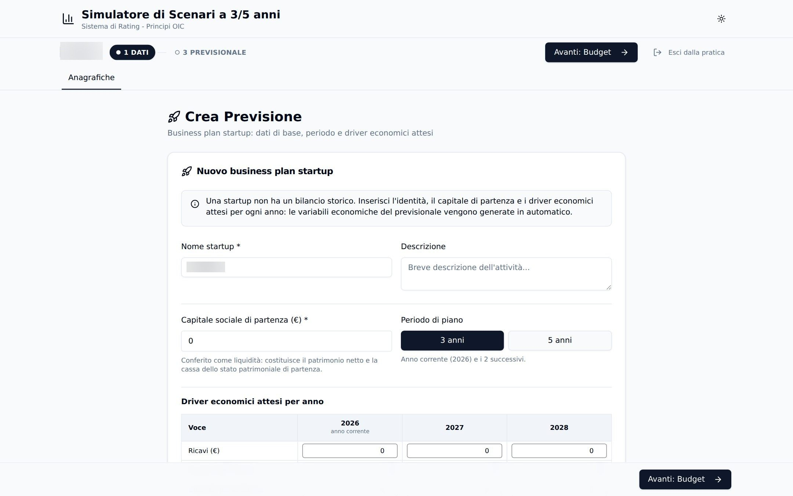

**Attenzione a.** Il percorso Startup **non** ammette rettifiche, non ha anno base da bilancio e
non usa le percentuali del wizard ordinario: è lo stesso motore di previsione, ma alimentato a
driver. Le griglie CE Prev./SP Prev. restano disponibili, con gli stessi override.

---

# I due percorsi completi

## A · Da un bilancio PDF a un Business plan

1. **Home → Nuova azienda** (o espandi la scheda se l'azienda esiste già): nome, partita IVA,
   settore. → «Nuova pratica» → **Da bilancio**.
2. **Anagrafica**: verifica nome e settore; «Salva e prosegui».
3. **Import**: anno, «anno intero», trascina il PDF. Leggi la quadratura e gli avvisi
   (§ DATI › Import).
4. **Rettifiche**: correggi in partita doppia; **«Conferma rettifiche»**. È il gate: niente
   ANALISI senza. Se il bilancio non quadra puoi confermare lo stesso: l'avviso resta.
5. **Analisi**: Confronto, Indicatori, Stampa. Se hai importato un periodo sotto i 12 mesi,
   compare in più la tab Proiezione.
6. **«Prosegui al Budget»** (in alto a destra nella tab Stampa): crea lo scenario con l'anno base
   che hai importato e apre il wizard al passo 1.
7. I 7 passi del wizard; all'ultimo **«Salva e Calcola Previsionale»**, e leggi sempre il toast.
8. **Indici** (menu «Previsionale»): il quadro di rating che il documento riporterà. Poi
   **Report**: seleziona lo scenario, leggi il banner e **«Scarica PDF finale»**; se il pulsante
   è «Scarica bozza», risolvi prima i controlli bloccanti elencati nel banner.

## B · Da un semestrale a un'analisi infrannuale

1. **Home → Nuova pratica → Da bilancio**; **Anagrafica**.
2. **Import** con **periodo parziale = 6 mesi**: il parziale coesiste con l'eventuale annuale
   dello stesso anno, non lo sostituisce.
3. **Rettifiche** su entrambe le schede — storico e parziale — e conferma: ciascuna ha il suo
   giornale e il suo tetto di 20 voci.
4. **Confronto**: semestre annualizzato contro l'ultimo anno pieno.
5. **Proiezione**: se serve, aggiusta le righe CE; **«Genera proiezione e indicatori di
   crisi»** (un fabbisogno scoperto qui esce in diagnosi di errore: lo scenario non è
   promuovibile finché non lo copri).
6. **Indicatori**, poi **Stampa**: i sei commenti AI (editabili) e **«Scarica PDF»** — *quello*
   è il documento.
7. Se il semestre deve diventare base di un budget: **«Prosegui al Budget»** — promuove la
   proiezione copiandola nel bilancio annuale di quell'anno, **sostituendolo** se era già stato
   importato (è l'unico passo distruttivo del percorso: verifica prima la quadratura), e apre il
   wizard.

---

# Glossario

| Termine | Una riga |
|---|---|
| **Anno base** | L'ultimo bilancio annuale consuntivo da cui il previsionale parte. |
| **Scenario / Budget** | La copia «cosa succede se» del bilancio: un set di ipotesi su N anni. |
| **Pregresso** | Ciò che sta già in bilancio al 31/12 dell'anno base (debiti residui, crediti oltre anno) e va scandenziato. |
| **Override / cella forzata** | Un importo fissato a mano che vince sulla percentuale di crescita e sopravvive ai salvataggi. |
| **DSO** | Giorni medi di incasso dei crediti commerciali (360 giorni, clienti, non crediti generici). |
| **DIO** | Giorni medi di magazzino; in due gruppi: materie/semilavorati sul consumo, finito/merci sui ricavi. |
| **DPO** | Giorni medi di pagamento dei debiti commerciali. |
| **MOL (EBITDA)** | Margine operativo lordo = utile operativo + ammortamenti. |
| **EBIT (RO)** | Risultato operativo, prima dei finanziari. |
| **PFN** | Posizione finanziaria netta = debiti finanziari − liquidità. |
| **CCN** | Capitale circolante netto = attivo corrente − passivo corrente. |
| **DSCR** | (MOL − imposte) ÷ (oneri finanziari + quota capitale delle rate dei piani). |
| **Break even point** | Il fatturato di pareggio, calcolato dalle quote fisse/variabili dei costi (non da un'ipotesi fissa 60/40). |
| **Infrannuale** | Periodo parziale (1-11 mesi) proiettato a 12 contro l'ultimo anno pieno. |
| **Riclassificato** | Lo SP per aree omogenee con i relativi indici. |
| **Quadratura** | Attivo = passivo (toleranza 0,01 €) e CE coerente con l'utile in SP. |

---

# Che cosa succede quando qualcosa non torna

| Segnale a schermo | Significato | Cosa fare |
|---|---|---|
| *«Fabbisogno finanziario scoperto di …: aggiungi un'ipotesi di finanziamento esplicita; nessun debito bancario è stato creato automaticamente.»* | Le ipotesi producono cassa negativa e lo scoperto non è concesso | passi 5/6: finanzia davvero (prestito nuovo, fido, o concedi lo scoperto), o riallinea le ipotesi |
| Toast che nomina una ragione e colonna «Previsione» vuota | Il salvataggio è riuscito ma il previsionale è stato **rifiutato** (risponde «ok» comunque) | il toast dice la ragione e il wizard ti riporta al passo che l'ha causata; correggi lì e salva di nuovo |
| *«Previsionale calcolato»* | Salvataggio e generazione riusciti | — |
| *«Documento bloccato · Forecast precedente alle ipotesi salvate.»* | Hai cambiato le ipotesi dopo l'ultima generazione | «Rigenera previsionale» nel banner giallo |
| *«Fidi e anticipi incompatibili con … forzato: servono … di fidi, ma il totale della voce è fissato dall'override.»* | Un override SP pretende una cassa che il piano dei fidi non può fare | togli l'override o copri il fabbisogno con un finanziamento (passo 5/6) |
| *«Massimo 20 rettifiche. Eliminane qualcuna per aggiungerne altre.»* | Il tetto del giornale di quell'anno | elimina rettifiche obsolete o raggruppale |
| **«n.d.»** su un indice | Denominatore non positivo, o dettaglio (crediti commerciali, debito finanziario) che l'import non ha mai classificato | integra il dettaglio in Rettifiche; non cercare il «bug» |
| Riga con delta pari a **2× l'importo** in Confronto/CE | una riga di costo è stata letta nella colonna dei ricavi (o viceversa) | rettifica di **direzione**, non di importo |
| **«Pratica da riaprire»** | Il server non riesce più a ricostruire la pratica (per esempio una pratica vecchia con un budget ma senza infrannuale dietro, o azienda/anno cambiati altrove) | riapri dalla home con «Nuova pratica»: i dati salvati restano |

---

# Dove andare dopo

- Aritmetica del motore budget → [docs/budget/FORECASTING_GUIDE.md](budget/FORECASTING_GUIDE.md)
- Contratti API (corpi, precedenze, cosa azzera cosa) → [docs/budget/API-PREVISIONALE.md](budget/API-PREVISIONALE.md)
- Percorso, gate e stepper → [docs/frontend/PRATICA-PERCORSO.md](frontend/PRATICA-PERCORSO.md)
- Giornale delle rettifiche → [docs/frontend/RETTIFICHE.md](frontend/RETTIFICHE.md)
- Import: routing, estrazione, quadrature → [docs/import/REGOLE-IMPORT-00-INDICE.md](import/REGOLE-IMPORT-00-INDICE.md)
- Business plan e report infrannuale → [docs/budget/BUSINESS-PLAN-PDF.md](budget/BUSINESS-PLAN-PDF.md), [docs/budget/REPORT-INFRANNUALE-PDF.md](budget/REPORT-INFRANNUALE-PDF.md)
