# Guida illustrata all'applicazione

> Última verifica: ottobre 2026, dalle schermate di sviluppo (azienda AMBIENTA, scenario
> «Budget 2027–2029» #18 e infrannuale 6M 2026 #17). Ogni immagine è una schermata reale
> dell'app; se una schermata cambia, aggiorna `docs/images/guida/` e questo file insieme.

**A chi serve.** Questa è la mappa di *che cosa si vede e dove*: ogni pagina dell'applicazione,
i suoi parametri, e che cosa fa premere quel pulsante. Non è la guida di aritmetica — per le
formule del motore vedi [FORECASTING_GUIDE.md](budget/FORECASTING_GUIDE.md) e per i contratti
delle API [API-PREVISIONALE.md](budget/API-PREVISIONALE.md). Dove una schermata nasconde una
regola che cambia i numeri, la regola è linkata alla sua pagina.

**I due percorsi.** L'app ha un unico ingresso, la **home**, e due workflow:

- **Da bilancio** (`/pratica`) — dall'importato all'analisi: tre fasi *DATI → ANALISI →
  PREVISIONALE*, sette passaggi, con un solo gate: nulla è raggiungibile finché le Rettifiche
  non sono confermate.
- **Startup** (`/budget` in modalità startup) — stesse schermate previsionali, senza bilancio
  importato dietro.

La barra di stato in testa a ogni pagina dice sempre **dove sei del percorso** (`1 DATI`,
`2 ANALISI`, `3 PREVISIONALE`) e l'azienda + anno di pratica a sinistra.

---

## 0. La home — aziende e pratiche

`/`

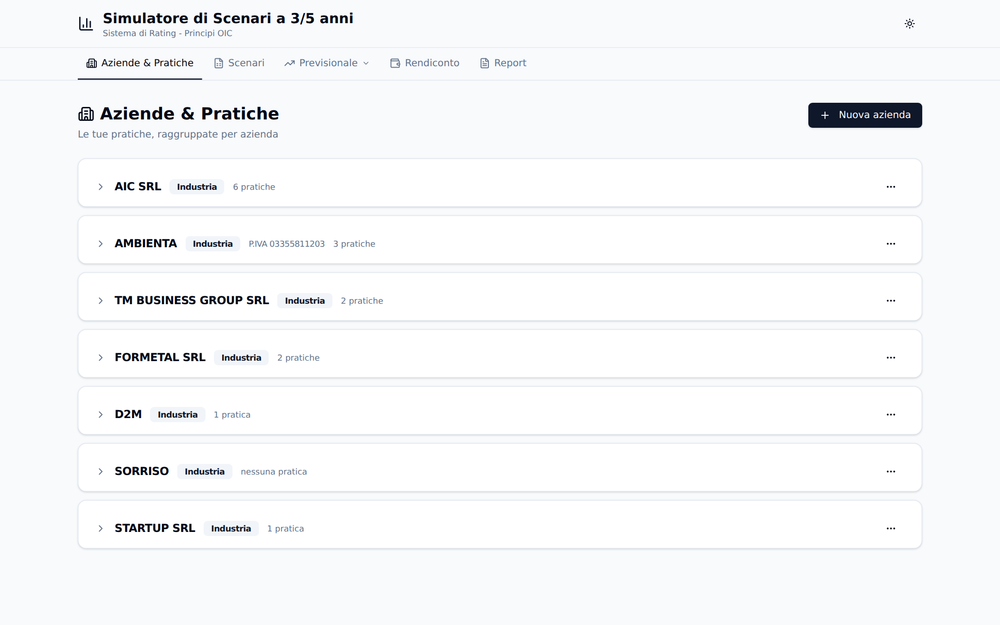

L'elenco delle tue aziende (max 50 per utente). Ogni riga è un pulsante che apre la pratica:

- **«Riprendi»** riparte dall'ultimo passaggio raggiunto (lo stato è nel browser, ma viene
  riverificato sul server — se il server contraddice la cache, prevale il server).
- **«Nuova pratica»** apre la scelta fra **Da bilancio** (importi un bilancio, anche solo di
  verifica, e poi analizzi) e **Startup** (nessun bilancio, solo ipotesi).
- **«Da bilancio esistente»** collega un anno già importato a uno scenario budget e porta
  direttamente al wizard.

In alto: ricerca, filtro percorso, ordinamento, ed «Eliminata di recente» (le aziende si
cancellano in modo recuperabile). «Gestisci aziende» apre anagrafica, imponenza fiscale e
settore (1 Industria … 6 Edilizia — il settore sceglie il modello Altman e le soglie FGPMI).

---

# FASE 1 · DATI

## 1. Anagrafica

`/pratica` → tab *Anagrafiche*

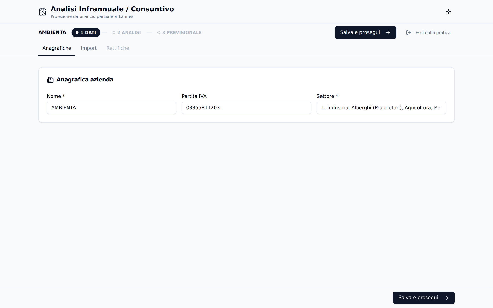

La carta d'identità dell'azienda: denominazione, CF/PIVA, sede, forma giuridica, codice ATECO
(la lista propone i 77 settori cui `data/sectors.json` aggancia indici di settore e
percentuali di crescita standard), imponenza fiscale. Sotto, il blocco **Conto Economico
Strutturato** anteprima: le sezioni di CE come le vedrai in ogni tabella dell'app (A) valore
della produzione, B) costi, differenza = MOL/EAV, più D) componenti finanziari ed E) componenti straordinari, fino al risultato. Qui non si
modifica nulla — la scheda mostra ciò che è stato importato, per verificare di star lavorando
sull'azienda giusta.

## 2. Import

`/pratica` → tab *Import* (esiste anche una pagina autonoma `/import`, non raggiungibile
dalla navigazione — la via normale è questa tab)

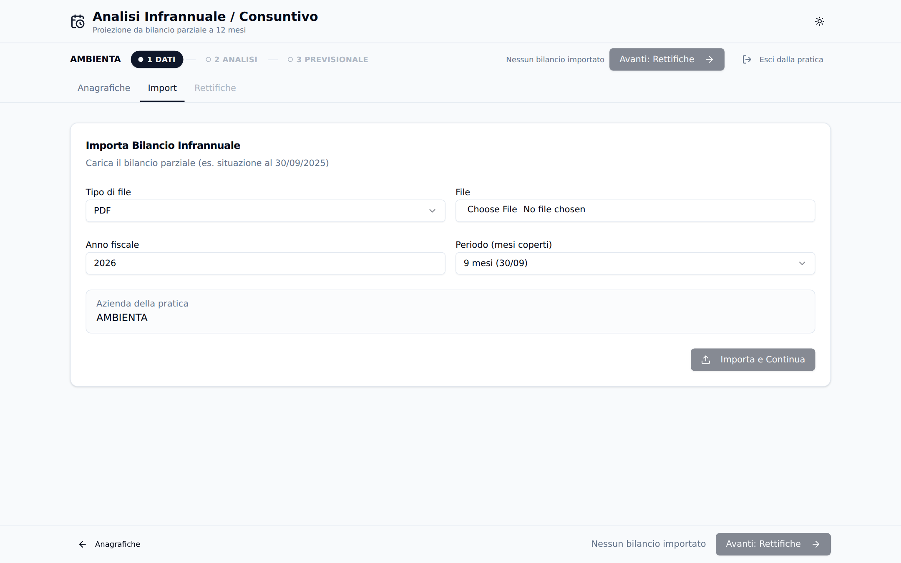

Si importa il file (XBRL, CSV TEBE, PDF — anche con OCR MinerU dove attivo) e si dichiara il
periodo: **bilancio a 12 mesi** o **parziale con mesi 1–11** (un parziale apre la strada
all'infrannuale). Regole importanti:

- Un file parziale e uno annuale per lo stesso anno **coesistono di proposito**; l'app sceglie
  quale leggere con le sue regole di priorità.
- L'esito mostra **quadratura, avvisi e sbilanci dichiarati** — un bilancio che non quadra si
  importa comunque con avviso, e si corregge in Rettifiche; non viene «aggiustato» in silenzio.
- «Vuoi vedere gli errori e correggerli?» è il ponte verso le Rettifiche.

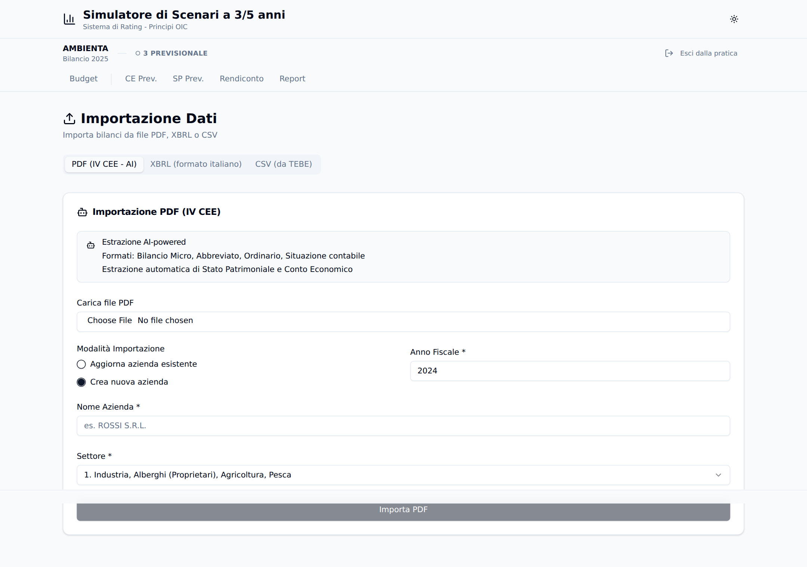

La pagina `/import` completa, con lo storico degli upload. Per la selezione del file:
il menu Import della barra superiore.

## 3. Rettifiche

`/pratica` → tab *Rettifiche* — una tab **per anno** (storico + bilancio di verifica), entrambe
da confermare prima di proseguire

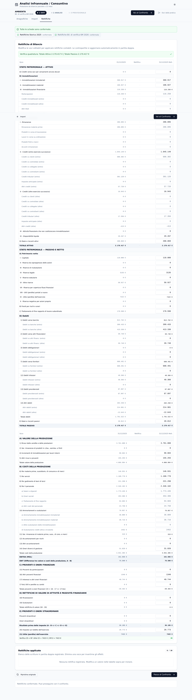

Il giornale in partita doppia sul bilancio importato: massima, dare/avere, descrizione,
contropartita. È l'unico posto dove l'utente **corregge i numeri**; tutto ciò che sta a valle
legge il libro giornale, mai un valore «sistemato» dall'app. Tre gesti:

- **rettifica / riclassifica** in partita doppia (max 20 righe per giornale);
- **«Correggi Import»** in partita semplice;
- **ripristino** allo stato importato.

Una correzione che peggiora sbilancio, identità CE↔utile o coerenza aggregati/dettagli viene
**rifiutata dal server** (relativamente: ciò che è già sbagliato in partenza si può correggere).
Finché la tab non è confermata, lo stepper blocca tutto il resto del percorso.
→ [docs/frontend/RETTIFICHE.md](frontend/RETTIFICHE.md)

---

# FASE 2 · ANALISI (infrannuale)

Raggiungibile solo con un periodo parziale importato e le Rettifiche confermate. Le prime due
tab sono l'«occhiale» sul dato; Proiezione è dove il dato diventa anno pieno.

## 4. Confronto

`/pratica` → tab *Confronto*

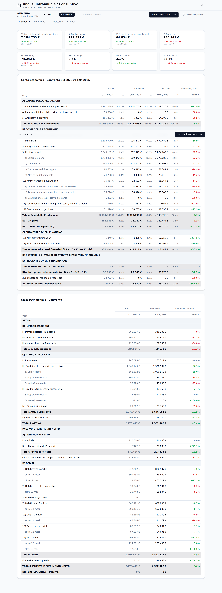

Riga per riga: il parziale contro l'anno di riferimento pieno, con la variazione. Il CE è
annualizzato (`× 12 / mesi`), lo **stato patrimoniale no** — è un istante, non un flusso: la
distinzione è scritta sotto le tabelle «Valori Istantanei». Da qui partono le percentuali di
crescita che il passaggio 3 userà: cambiare un valore qui significa cambiare la proiezione.

## 5. Proiezione

`/pratica` → tab *Proiezione*

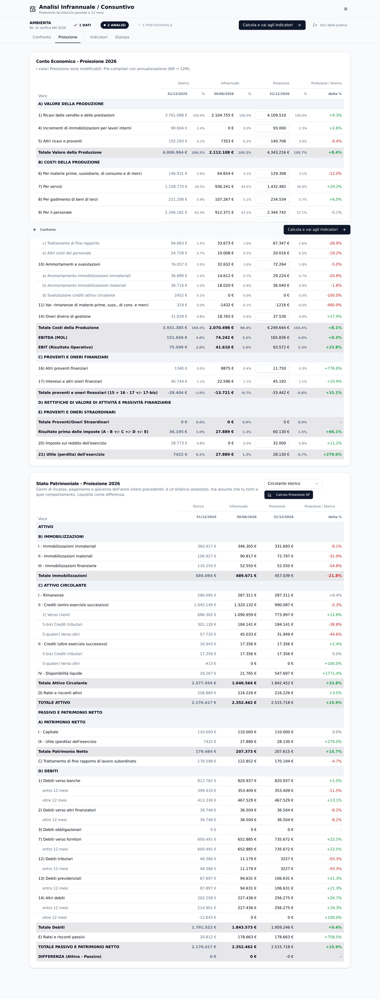

22 righe di conto economico modificabili a mano; i subtotali si ricapitolano nel client, lo
**stato patrimoniale proiettato lo calcola il server** (`calculations/intra_year_engine.py`) e
appare sotto. Il pulsante «Genera proiezione e indicatori di crisi» salva le ipotesi, fa
rigenerare il motore e rilegge — non c'è (più) un secondo calcolatore in TypeScript. Due scelte
di fondo visibili qui:

- ammortamenti: annualizzati, mai «cresciuti»;
- il debito finanziario è riportato dal parziale così com'è, non ruota coi ricavi; solo il
  residuo operativo ruota sui ratio dell'anno di riferimento.
- **Modo circolante** (`working_capital_mode`): *storico* (i giorni dell'anno di riferimento —
  default), *infrannuale* (i giorni osservati nel periodo), *equilibrio* (cerca i giorni che
  chiudono la cassa a zero). → [REGOLE-IMPORT-05](import/REGOLE-IMPORT-05-INFRANNUALE.md) §5-bis

## 6. Indicatori

`/pratica` → tab *Indicatori*

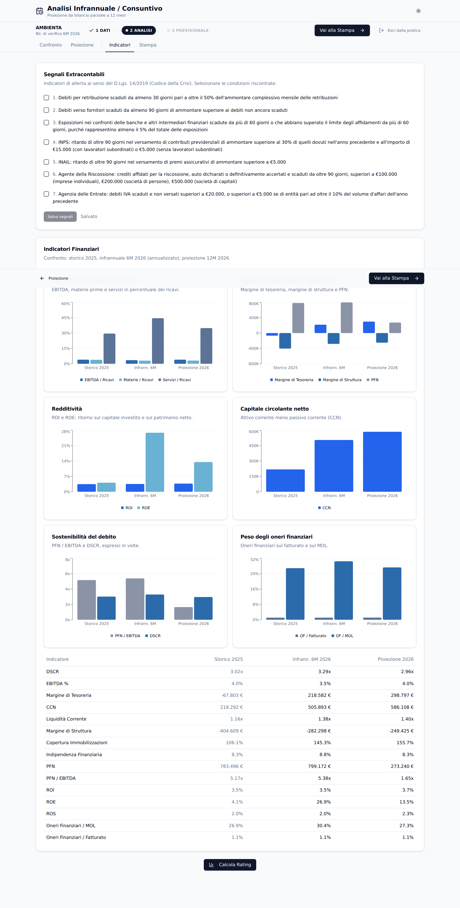

Gli stessi blocknotes dell'analisi annuale (sotto § 9) sulla colonna proiettata, più i
**15 segnali di allarme** della crisi d'impresa (14 concorrono al punteggio, `of_revenue` è
informativo): verde/ambra/rosso, misurati **sul server** (`calculations/crisi_impresa.py`); la
classe di rating A3→D si sceglie dal numero di segnali. I due grafici sono un componente solo
anche nella Stampa. → [INDICATORI-E-STAMPA.md](frontend/INDICATORI-E-STAMPA.md)

## 7. Stampa

`/pratica` → tab *Stampa*

Il documento infrannuale impaginato: sintesi, CE, SP, circolante, debito, crisi, segnali,
allegati A/B, con i **sei commenti AI** (generati da Haiku su Confronto/Proiezione/Indicatori,
poi editabili — allowlist di sei chiavi, un settimo verrebbe scartato in silenzio). Il pulsante
vero è **«Scarica PDF»**: chiama `POST /scenarios/{id}/infrannuale/pdf`, lo stesso ReportLab
del Business plan; la stampa del browser è solo un'anteprima. «Scarica Word» esporta lo stesso
report in `.docx` dagli stessi flowable. Gli avvisi (es. *bilancio in perdita*) sono a squillo
del testo; i commenti chiusi spariscono dal PDF. →
[REPORT-INFRANNUALE-PDF.md](budget/REPORT-INFRANNUALE-PDF.md)

---

# FASE 3 · PREVISIONALE

Cinque tab: **Budget** (il wizard), **CE Prev.**, **SP Prev.**, **Rendiconto**, **Report**.

## 8. Il wizard in 7 passi

`/budget` — pulsante «Crea un nuovo scenario» o «Modifica» su uno scenario esistente

### Passo 1 · Scenario

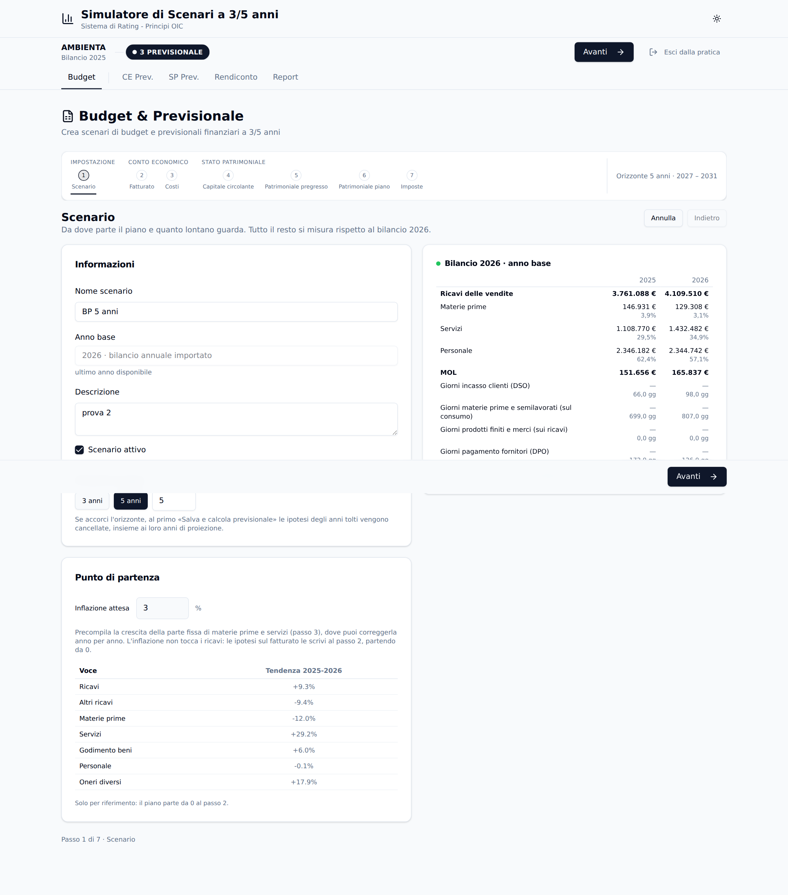

Nome, **anno base** (l'ultimo bilancio annuale che possiedi), **orizzonte 3 o 5 anni**, e
l'inflazione (driver che «si propaga» ai costi che hanno la crescita automatica). In basso, la
tabella degli scenari esistenti con gli indicatori sintetici di quadratura «Sb», «CF»
(salvataggio e ricalcolo, «Salva e Calcola Previsionale», sono il pulsante nero a destra
della barra).

### Passo 2 · Fatturato

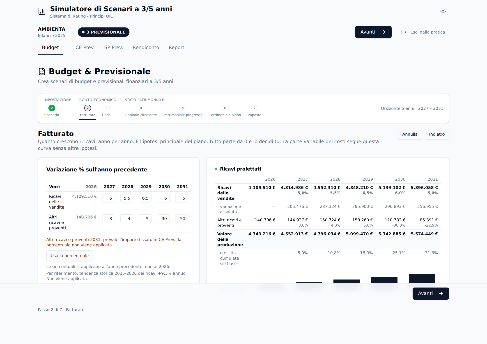

Una riga di crescita dei **ricavi** e una degli **altri ricavi** per ogni anno di piano.
«Tutti gli anni»: un valore solo su tutto l'orizzonte (e se l'orizzonte è 5 ma i valori salvati
sono 3, lo stesso pulsante estende l'orizzonte — è la scorciatoia per l'estensione multi-anno
del 5×). A destra, l'anteprima dal vivo: il conto economico dell'anno base proiettato con
queste ipotesi, riga per riga, delta a lato.

### Passo 3 · Costi

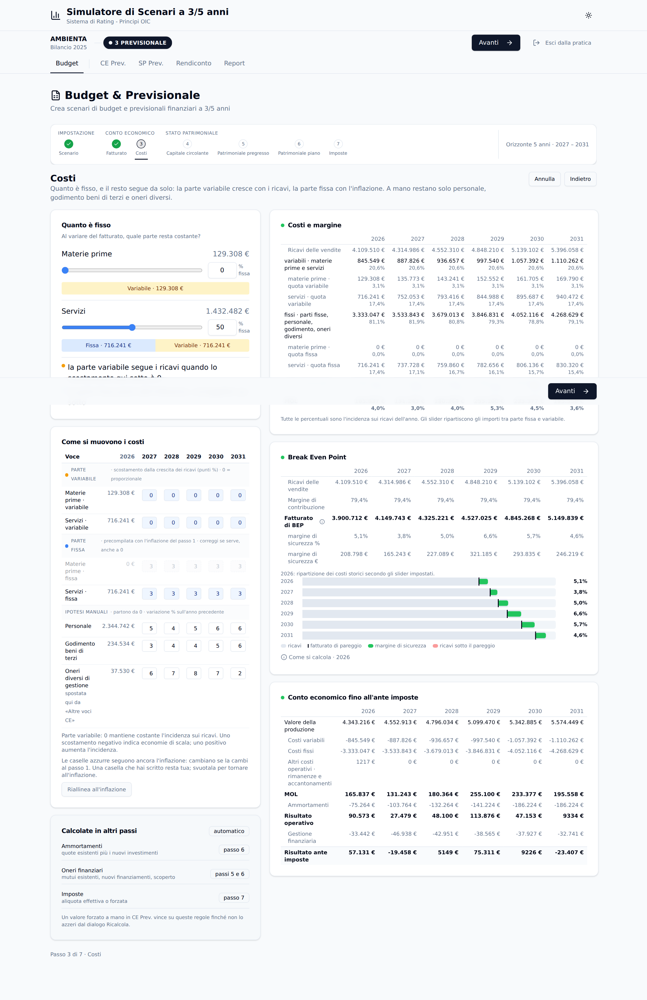

Per ogni famiglia di costo (materie, servizi, personale, locazioni, altri) due leve: la
**quota fissa** (slider, di default 40% — è la separazione variabile/fisso su cui il motore
divide ogni costo) e la **crescita** ( Automatica = PIL + inflazione, o Manuale). Note
importanti dalla prova: la quota fissa è una sola e **si applica a tutti gli anni** (il
modello è per anno, l'interfaccia no — se uno scenario ha valori diversi fra anni, la
schermata avvisa e allinea al primo tocco).

### Passo 4 · Capitale circolante

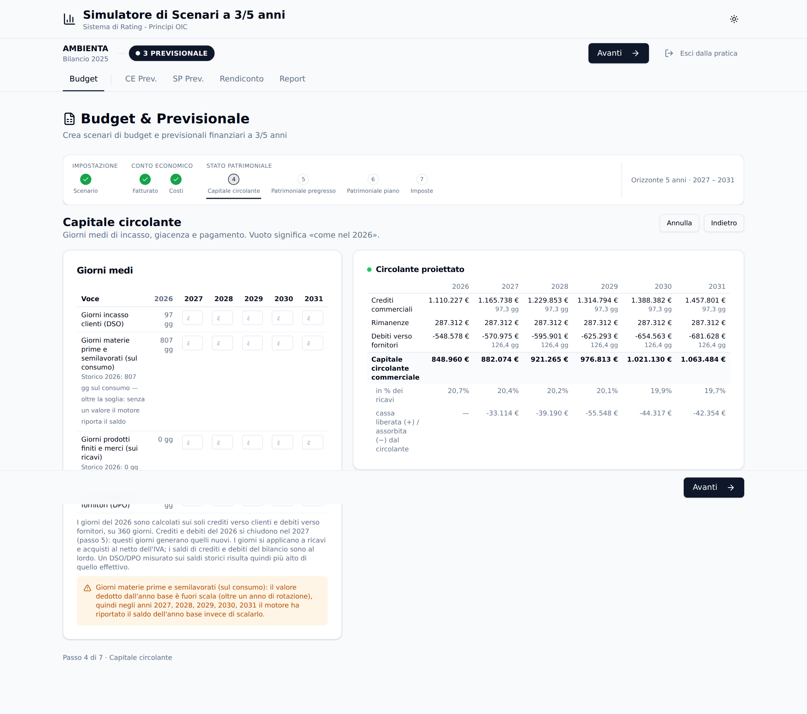

I giorni medi per anno: **DSO** (incasso clienti), **giorni materie prime e semilavorati (sul
consumo)** e **prodotti finiti e merci (sui ricavi)** — i due gruppi del DIO (#62 S04:
`dio_days` + `dio_pf_days`; il DIO storico di prima vale ora per il solo primo gruppo) —,
**DPO** (pagamento fornitori), crescita dei crediti oltre 12 mesi. «Vuoto significa come
nell'anno base». A destra il circolante proiettato con «cassa liberata/assorbita». Due note
tecniche reali: i giorni del 2026 sono calcolati su soli clienti/fornitori al netto IVA e su
360 giorni; un valore dedotto fuori scala (oltre un anno di rotazione) è **scartato** e il
motore riporta lo stock dell'anno base — l'avviso ambra in figura lo dichiara.

### Passo 5 · Patrimoniale pregresso

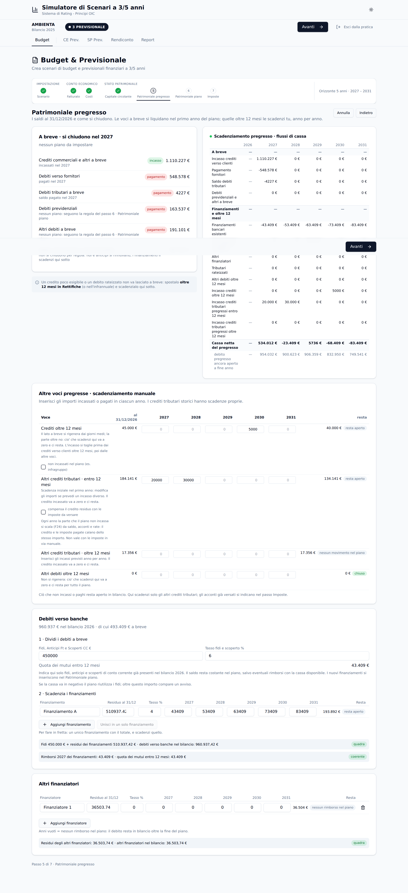

Che cosa succede ai saldi **già in bilancio** al 31/12 dell'anno base. Il lato breve senza
piano si chiude nel primo anno di piano; «quelle oltre 12 mesi le scandisci tu, anno per
anno», nelle sei righe «Altre voci pregresse · scadenzamento manuale» (crediti oltre 12 mesi,
crediti tributari entro/oltre 12, altri debiti oltre 12, con caselle per anno e «resta
aperto»). Poi i finanziamenti: **fidi, anticipi e scoperto** (importo + tasso; è il regime
esplicito dei fidi: sotto di esso il fabbisogno non apre uno scoperto ma tira sui fidi),
scadenza dei prestiti bancari pregressi (anno per anno), altri finanziatori. Le due righe
«quadra/coerente» in fondo sono i controlli sul totale: la massa non riconosciuta non può
finire sui debiti finanziari.

Un vincolo che qui fa rumore: **un anno in via manuale non può scaricare meno di quanto il
piano tributario ripartirà l'anno dopo**, o la stessa rata uscirebbe due volte — il motore
rifiuta la combinazione con un errore in italiano che nomina l'anno e le tre vie d'uscita.
→ [API-PREVISIONALE.md](budget/API-PREVISIONALE.md)

### Passo 6 · Patrimoniale piano

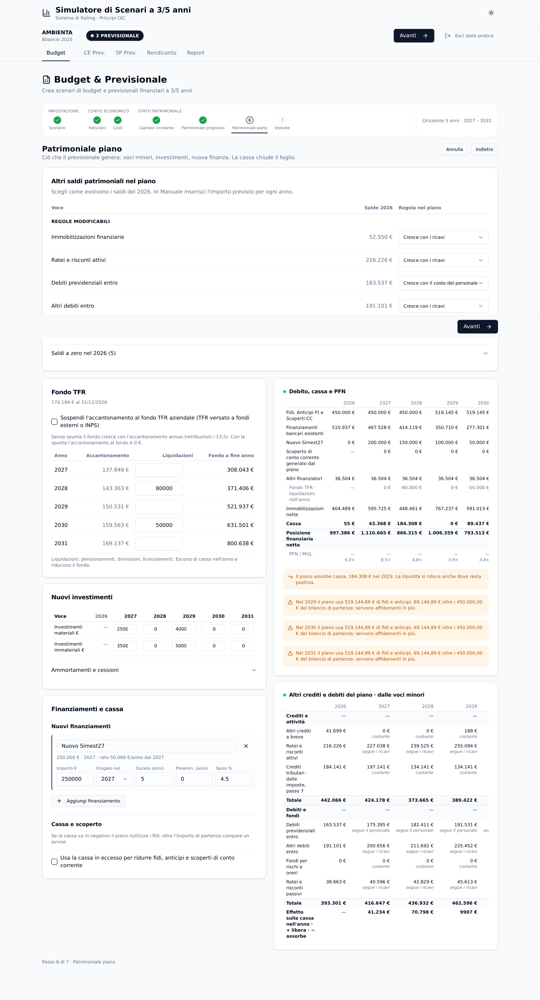

Che cosa il piano **genera**: immobilizzazioni (creste e dismissioni, con aliquota di
ammortamento — i nuovi cespiti ammortizzano a metà aliquota nell'anno di entrata), nuovi
finanziamenti (importo, anni, durata: la quota in scadenza l'anno dopo finisce
correttamente a breve), debiti indicizzati al personale o all'inflazione (tendina per
voce — il doppio comando «gli enti previdenziali scalano col personale» non esiste più),
liquidazioni TFR (sopra il fondo disponibile: **rifiuto**, non clamp), e la **cassa**: sweep
(pareggia prima lo scoperto, anche sotto il minimo di liquidità), minimo di liquidità, e
«ammetti uno scoperto di banco» — spento di default, quindi un fabbisogno senza rimedio fa
fallire la generazione con un errore, non un numero inventato.

### Passo 7 · Imposte

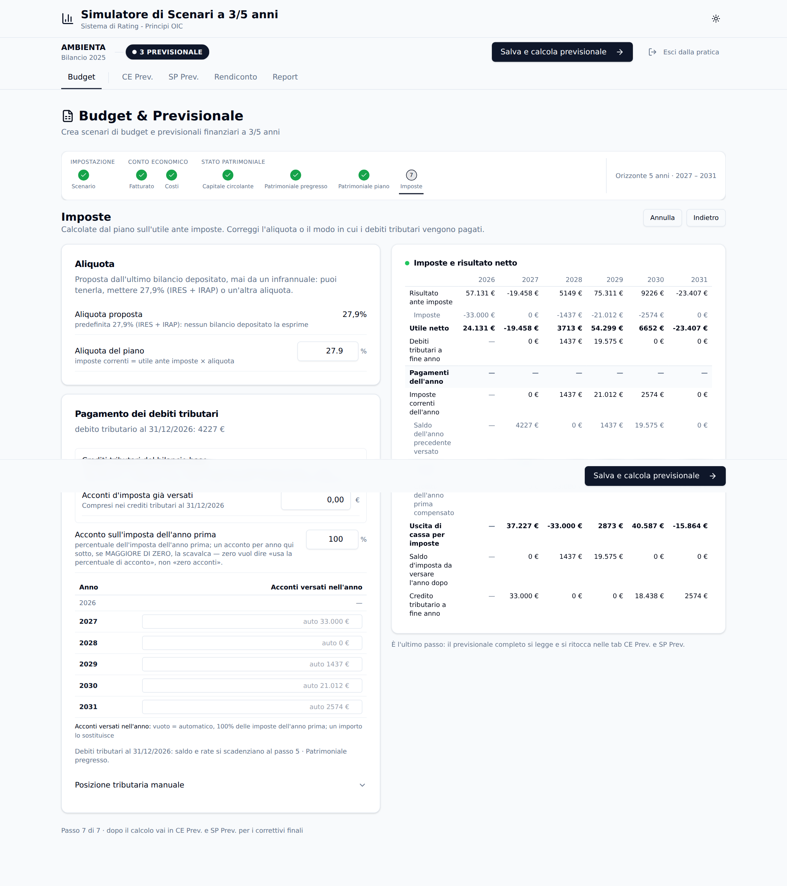

**Aliquota**: proposta dall'ultimo bilancio annuale depositato (mai da un infrannuale, mai da
una proiezione), 27,9 = IRES+IRAP quando non derivabile; l'aliquota è usata **così com'è**.
**Pagamento dei debiti tributari**: la regola di cassa del commercialista — ogni anno paga il
**saldo** dell'anno prima + gli **acconti** dell'anno (100% dell'imposta dell'anno prima, o
l'importo esplicito «già versato» se maggiore di zero; **zero nella casella non vuol dire
«zero acconti»**, vuol dire «usa la percentuale»). «Compensa il credito residuo con le
imposte da versare» è la scelta esplicita (#62 S14/S18). La cassa non è più gonfiata di
un'imposta all'anno come prima di questa regola, e «Uscita di cassa per imposte» nei righi a
destra è proprio quella pagata.

Il pulsante finale **«Salva e calcola previsionale»** è la porta: legge `forecast_generated`,
**non** il 200 (una generazione rifiutata risponde comunque 200 con la ragione nel `message`).

## 9. CE Previsionale

`/forecast/income`

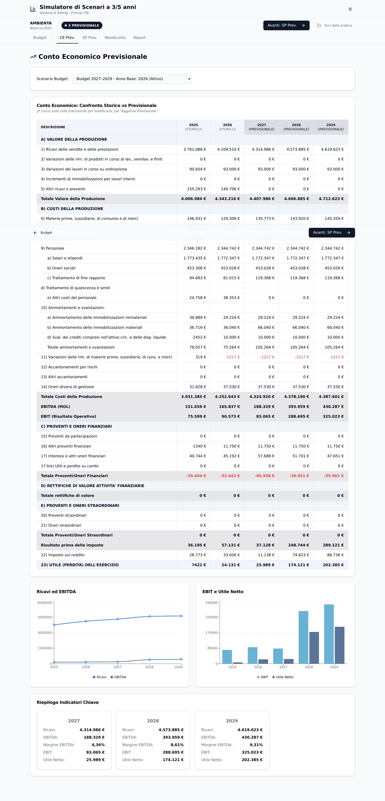

Il conto economico di piano **cella per cella**, anno per anno, in griglia modificabile:
digitare una cella scrive un `ce*_override` che **vince sulla percentuale di crescita e
sopravvive a ogni salvataggio successivo** — l'unica cosa che lo cancella è la casella
«Azzera le modifiche manuali del CE» nel dialogo Ricalcola. I subtotali (MOL, EAV, utile) si
ricapitolano a lato; «Modifiche manuali attive» le elenca tutte. Un override rifiutato dal
motore (perché oltre la giacenza di magazzino, per esempio) non resta persistito: la cella
torna com'era, con l'errore italiano che dice perché.

## 10. SP Previsionale

`/forecast/balance`

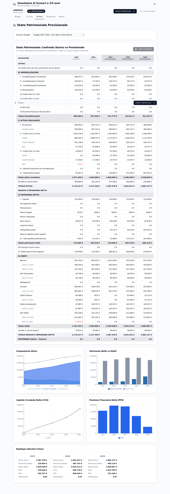

Lo stato patrimoniale di piano, stessa logica: celle modificabili che scrivono nel sacco
`sp_overrides` (non colonne `*_override`). È qui che si forzano i saldi — con tre limiti che
il motore fa valere: le righe governate da un piano (il lungo dei saldi scadenzati, la parte
commerciale sotto il residuo) si **rifiutano**; le righe a giorni (DSO/DPO) valgono **un anno
solo** e dall'anno dopo tornano alla formula; e un override che squilibra il foglio non si
chiude più con cassa a zero: il fabbisogno si misura dopo l'override, e o solleva o diventa
scoperto se concesso.

## 11. Riclassificato

`/forecast/reclassified` (pagina di sola lettura)

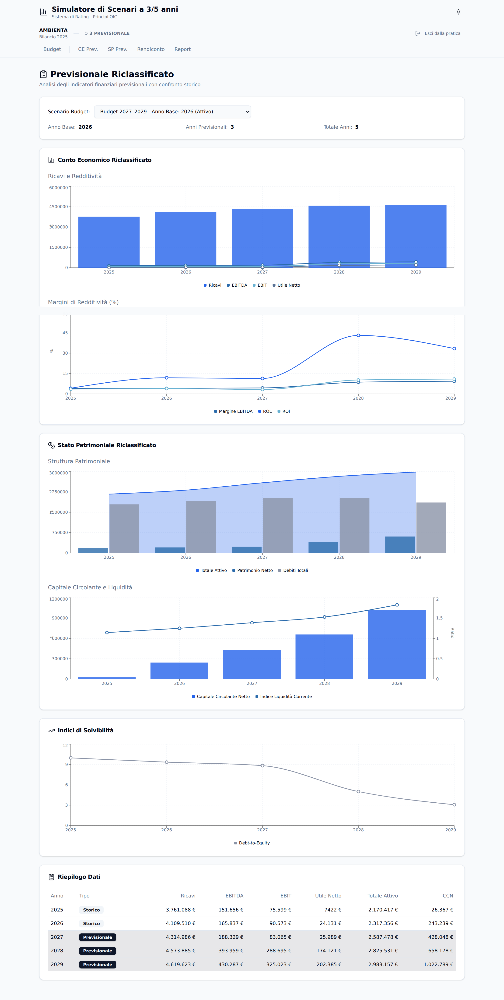

Lo SP riclassificato (attivo, passivo, patrimonio netto) e il **rendiconto finanziario
riclassificato per indici** per anno: solidità patrimoniale, copertura delle immobilizzazioni,
indici di liquidità, composizione delle fonti. Sotto, gli indicatori di performance con
formula e soglia (DSCR, PFN/EBITDA, punto di pareggio e margine di sicurezza) — dove il
denominatore manca, **n.d.**, mai zero.

## 12. Rendiconto

`/cashflow`

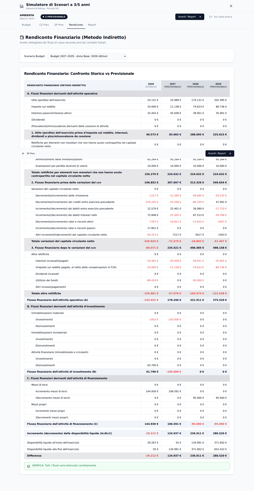

Il rendiconto finanziario **metodo indiretto** (OIC), storico contro previsionale: A)
operativo, B) investimento, C) finanziamento, con la verifica in fondo («Tutti i flussi sono
bilanciati correttamente» è un controllo, non una cortesia). Due raffinatezze volute: le
**erogazioni** (finanziamenti nuovi, incluso il tiraggio di fido) stanno in una riga separata
dai **rimborsi**, e il DSCR usa la **quota capitale contrattuale dei piani** — non il rimborso
di uno scoperto o di un fido. Il circolante prende le variazioni `sp16`/`sp17` al netto dei
debiti finanziari, che sono flusso di finanziamento: il confine è ancorato agli aggregati.

## 13. Report — il Business plan

`/report`

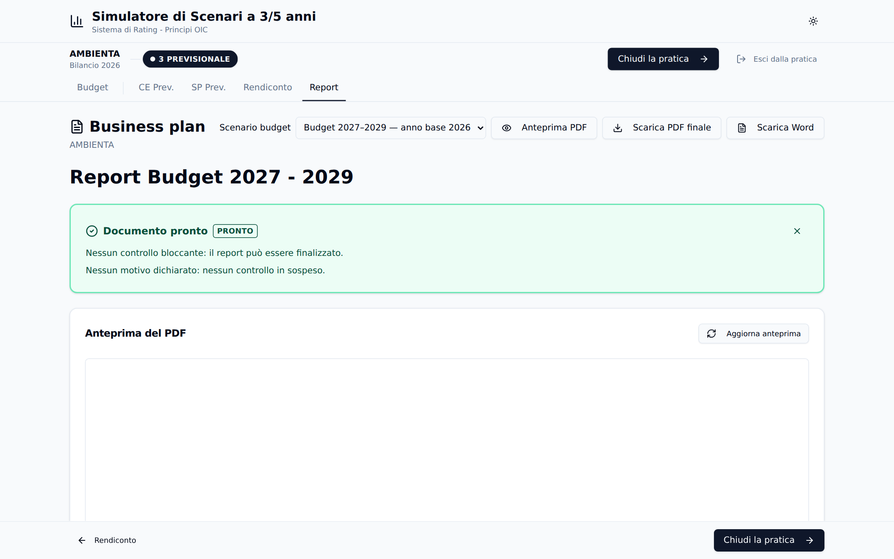

La pagina di consegna: selettore scenario, **«Anteprima PDF»**, «Scarica PDF finale» (finché un
controllo blocca il documento il pulsante resta bloccato con la ragione accanto), «Scarica
Word». Il banner di stato è il verdetto: **«Documento pronto»** / **«BOZZA · da rigenerare»**
— quest'ultimo quando le ipotesi sono più recenti dell'ultima generazione o il motore è
cambiato (`engine_version_stale`); il testo intero della ragione è in copertina nel PDF, la
forma corta qui per non troncare il nome azienda. Il PDF è ReportLab (13 pagine: copertina con
indice, sintesi, CE, SP, circolante, debito, crisi d'impresa, segnali, allegati A/B) e le sue
regole stanno in [BUSINESS-PLAN-PDF.md](budget/BUSINESS-PLAN-PDF.md).

Sotto, **«Vista web del dossier»**: lo stesso documento in HTML, con indice laterale (Perimetro
· Sintesi · Fonti · Rettifiche · Chiusura · Ipotesi · CE · SP · Cassa · Indicatori ·
Diagnostica · Appendici) e le tabelle/grafici per sezione.

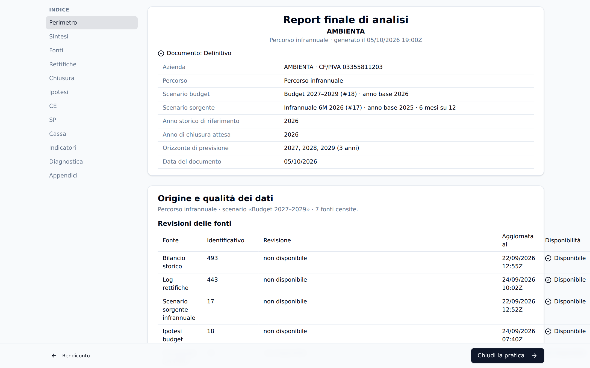

La sezione Fonti è la tracciabilità: **ogni fonte del documento con il suo numero di
revisione e la data** («Origine e qualità dei dati»), così un numero del PDF si può sempre
rispedire al file che l'ha prodotto.

## 14. Analisi finanziaria completa (Indici)

`/analysis`

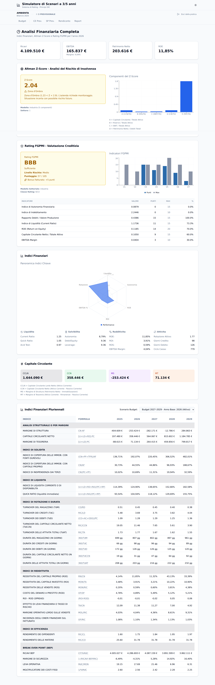

Il cruscotto sugli **indici di legge**: i blocknotes in alto (Ricavi, EBITDA, PN, ROE), Altman
Z-Score con zona e componenti, **rating FGPMI** (V1–V7 su soglie di settore, classe AAA→BB-),
i grafici radar/bar, e la tabella pluriennale con la **formula di ogni indice** accanto al
valore. Da leggere con le scelte di perimetro in testa: il DSO è sui soli **crediti
commerciali** (`None` se il dettaglio manca, non zero), il DIO sul **consumo di materie**, il
ROD sul **debito medio** e la PFN sul perimetro finanziario completo, il CCN simmetrico sui
ratei. Un valore «n.d.» è una dichiarazione, non un buco. → sezione «Indici e report» in
CLAUDE.md; la tabella pluriennale si può filtrare su uno scenario (`Scenario Budget` in alto
a destra nella tabella).

---

## Che cosa succede quando qualcosa non torna

| Segnale a schermo | Significato | Cosa fare |
|---|---|---|
| Toast verde + colonna Proiezione vuota | il bulk ha risposto 200 ma `forecast_generated: false` | leggi il `message`: il rifiuto dice tutto (di solito un fabbisogno scoperto o un override governato da piano) |
| «BOZZA · da rigenerare» | ipotesi più recenti della generazione, o motore cambiato | «Ricalcola» (dialogo: puoi azzerare gli override del CE) |
| «n.d.» su un indice | denominatore non positivo o dettaglio mai classificato dall'import | integra il dettaglio in Rettifiche, non cercare il bug |
| «Pratica da riaprire» | la cache del browser non torna col server | chiudi e riapri la pratica dalla home |
| Riga con delta **2× l'importo** | un costo letto nella colonna ricavi (o viceversa) | rettifica di direzione, non di importo |

## Dove andare dopo

- Aritmetica del motore budget → [docs/budget/FORECASTING_GUIDE.md](budget/FORECASTING_GUIDE.md)
- Contratti API (corpi, precedenze, che cosa azzera che cosa) → [docs/budget/API-PREVISIONALE.md](budget/API-PREVISIONALE.md)
- Percorso, gate e stepper → [docs/frontend/PRATICA-PERCORSO.md](frontend/PRATICA-PERCORSO.md)
- Giornale delle rettifiche → [docs/frontend/RETTIFICHE.md](frontend/RETTIFICHE.md)
- Import: routing, estrazione, quadrature → [docs/import/REGOLE-IMPORT-00-INDICE.md](import/REGOLE-IMPORT-00-INDICE.md)
- Il documento infrannuale e il Business plan → [docs/budget/REPORT-INFRANNUALE-PDF.md](budget/REPORT-INFRANNUALE-PDF.md), [docs/budget/BUSINESS-PLAN-PDF.md](budget/BUSINESS-PLAN-PDF.md)
