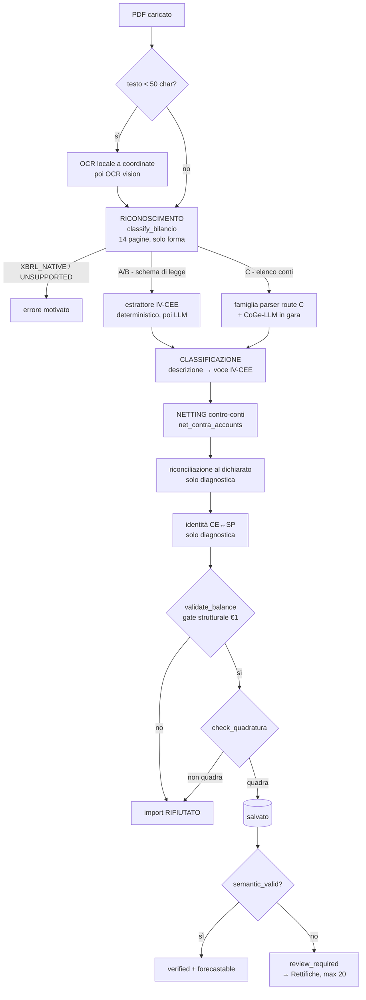

# Schema: riconoscimento → classificazione → netting

> **Scopo.** Un quadro unico di come funziona *davvero* la catena, e delle strategie per
> migliorarla. Sintetizza `REGOLE-IMPORT-02/03/04` e `FIXING-IMPORT.md`, ma aggiunge la parte
> che manca in tutti e quattro: **una politica esplicita di che cosa fare quando non si sa
> classificare**.
>
> Fonti verificate sperimentalmente il 2026-07-27 (vedi
> `docs/piano-import-2026-07/14-AUDIT-CLASSIFICAZIONE-E-NETTING-2026-07-27.md`).

---

## Parte I — Come funziona oggi

### I.1 La catena in un colpo d'occhio



Tre fasi distinte, spesso confuse fra loro:

| Fase | Domanda | Motore | Sbaglia se… |
|---|---|---|---|
| **Riconoscimento** | *Che tipo di documento è?* | `bilancio_classifier` | manda un elenco conti a un estrattore di schema legale |
| **Classificazione** | *Questa riga che voce IV-CEE è?* | `resolve()` **oppure** `_classify_*` | mette un fondo ammortamento fra i debiti |
| **Netting** | *Questo conto riduce un altro conto?* | `net_contra_accounts` | lascia l'attivo lordo e i fondi al passivo |

### I.2 Riconoscimento — decide la strada, non i numeri

Non legge mai importi. Guarda marcatori testuali, densità di codici conto e la geometria del
file. Prima regola che scatta vince. Dettaglio completo in `REGOLE-IMPORT-01`.

Il perno è `legal_skeleton` = "valore della produzione" **e** "immobilizzazioni" entrambi
presenti. Con lo scheletro si va in A/B (schema di legge); senza, e con marcatori di elenco
conti, si va in C.

**Verificato**: sui 17 PDF disponibili il router non sbaglia una route.

### I.3 Classificazione — qui c'è il problema strutturale

Esistono **due sistemi paralleli e scollegati**:

| | Motore | Dati | Usato da |
|---|---|---|---|
| **A** | `iv_cee_hierarchy.resolve(desc, side)` | `data/iv_cee_tree.json` (albero IV-CEE canonico) | `_be_reclassify` (best-effort) |
| **B** | `_classify_ce_costi/_ricavi/_sp_attivo/_sp_passivo` | tabelle di keyword inline in `situazione_contabile_parser` | `_hier_reconstruct`, parser strutturati |

Non condividono nulla e **ciascuno ignora ciò che l'altro sa**:

| Descrizione | A `resolve()` | B `_classify_ce_costi` |
|---|---|---|
| `AMMORTAMENTI` | **ce09** ✓ | **None** ✗ |
| `COSTI PERSONALE DIPENDENTE` | **None** ✗ | **ce08** ✓ |
| `ACQUISTI DI BENI` | None ✗ | None ✗ |

Quando B non risolve, il codice fa `f = _classify_ce_costi(d) or 'ce12'` — **catch-all muto**.

### I.4 Netting — la fase più fragile e la più costosa se sbaglia

Un fondo ammortamento è un **contro-attivo**: riduce l'immobilizzazione, non è un debito.
`net_contra_accounts` rilegge il documento, somma i fondi e sovrascrive `sp02`/`sp03` con i
valori netti, togliendo dai debiti esattamente l'eccesso del passivo sul nuovo attivo.

Due gate, e se uno cade → **no-op** (nessuna scrittura):

| Gate | Condizione |
|---|---|
| 1 | massa contro > **1%** del totale dichiarato |
| 2 | lordo scansionato riconcilia col dichiarato entro **0,5%** |
| *(fallback)* | modalità *anchored*: usa i subtotali immobilizzazioni stampati, con requisiti più severi se la fonte è OCR |

**Il caso che hai visto** (`f.do ammortamento` → `Altri debiti`, tutti i KPI sbagliati) è
esattamente `613_2024`, ed è misurato: il dedup padre/figlio usa i **prefissi di codice**
(`c.startswith(code)`), ma AGO usa due famiglie disgiunte — mastri a 8 cifre (`13095000`) e
dettagli a 9 cifre (`101080000`). Nessuna coppia viene deduplicata, mastro e dettaglio sono
sommati entrambi, l'attivo scansionato sfora dello **0,836%**, il gate 2 cade, gli anchor non
ci sono → **`netted = 0`**. 2,25 M di fondi restano nei debiti e l'attivo resta lordo.

---

## Parte II — Il modello del raggio d'impatto

> **La classificazione non va valutata per precisione, ma per conseguenze.** Errori diversi
> costano ordini di grandezza diversi. Questo è il concetto che manca nella documentazione
> attuale, ed è quello che distingue il tuo caso "fondo ammortamento nei debiti" (catastrofico)
> dal caso "1.000 € in costi per servizi" (irrilevante).

### Classe 1 — Errori che cambiano i TOTALI  → mai accettabili

Il contro-conto non nettato è l'esempio puro: **gonfia due lati contemporaneamente**.

Su 613: attivo 4,98 M invece di 3,13 M, debiti +2,25 M. Effetto a cascata:

| Indicatore | Perché salta |
|---|---|
| Indipendenza finanziaria (PN/TA) | denominatore +59% |
| PFN, PFN/EBITDA | 2,25 M di debito inesistente |
| ROI, ROA, rotazione capitale | capitale investito gonfiato |
| Copertura immobilizzazioni | immobilizzazioni lorde invece che nette |
| Altman, FGPMI | tutti costruiti su questi |

**E c'è un aggravante scoperto in `projection_common.base_bank_debt`**: qualunque scarto fra
`sp16_debiti_breve` e la somma dei suoi sotto-campi viene assegnato **alle banche**. Quindi una
massa lasciata nell'*aggregato* senza sotto-campo diventa **debito bancario fantasma**, con
piano di rimborso e oneri finanziari proiettati sopra. Un fondo negli "altri debiti" è brutto;
un fondo nell'aggregato senza sotto-campo è **peggio**.

→ *Corollario operativo*: se devi usare un bucket generico, scrivilo **sempre in un sotto-campo
esplicito**, mai come residuo dell'aggregato.

### Classe 2 — Errori che attraversano un confine di KPI → dipende dalla materialità

Il totale è giusto, ma la massa scavalca una linea che un indicatore usa. I confini reali,
letti da `calculations/ce_result.py`:

```
Costi della produzione = ce05 + ce06 + ce07 + ce08 + ce09 + ce10 + ce11 + ce11b + ce12
EBIT                   = Valore della produzione − Costi della produzione
EBITDA                 = EBIT + ce09          ← ce09 è l'UNICO confine dentro i costi operativi
Gestione finanziaria   = ce13 + ce14 − ce15 + ce16
```

| Confine | Errore tipico | Costo |
|---|---|---|
| **ce09 vs qualunque altro costo** | `AMMORTAMENTI` → ce12 (budget_342: 36.500) | **EBITDA, MOL, PFN/EBITDA, OF/MOL, V7 FGPMI** |
| operativo vs finanziario (ce15) | interessi fra gli oneri diversi | EBIT e oneri finanziari |
| SP vs CE | costo letto come debito | pareggio e risultato |
| entro vs oltre (sp16/sp17) | debito a lungo letto a breve | CCN, current ratio |
| banche vs non-banche | mutuo fra i fornitori | PFN, piano di rimborso |

### Classe 3 — Errori dentro lo stesso aggregato → gratuiti per i KPI

Spostare massa fra `ce05`, `ce06`, `ce07`, `ce08`, `ce11`, `ce12` **non cambia né EBIT né
EBITDA**: entrano tutti nella stessa somma. Allo stesso modo `sp16d` vs `sp16g` non cambia il
totale debiti a breve né il CCN.

**Questo è esattamente lo spazio in cui la tua regola è corretta**: quando non si sa, "costi per
servizi" e "altri debiti / altri crediti" sono scelte **KPI-neutre**.

*Unica avvertenza*: `ce05` e `ce06` hanno assunzioni variabile/fisso **separate** nel motore
previsionale (`fixed_materials_percentage` vs `fixed_services_percentage`). Neutro sullo
storico e sul rating, non neutro sulla proiezione.

---

## Parte III — La politica proposta

### III.1 La scala di materialità

Definiamo `M = max(1.000 €, 0,1% del totale attivo)` — soglia relativa, così non è troppo
severa su un bilancio da 50 M né troppo lasca su uno da 300 k.

| Situazione | Regola |
|---|---|
| Massa **> M** e classe 1 (contro-conto, segno, lato) | **mai indovinare.** Se il netting non è certo → no-op e diagnostica. È il comportamento attuale e va tenuto |
| Massa **> M** e classe 2 (confine KPI) | non assegnare a un bucket generico. Meglio un warning esplicito e la voce in Rettifiche |
| Massa **> M** e classe 3 | bucket generico **con diagnostica** |
| Massa **≤ M**, qualunque classe | **bucket generico, silenzioso** — `ce06` costi per servizi / `sp16g` altri debiti / `sp06g` altri crediti, per far tornare CE e SP |

### III.2 Il principio guida

> **Il bilancio importato deve essere *utilizzabile*, non perfetto. Ma un errore che sposta un
> totale non è un'imprecisione: è un dato falso, e va rifiutato o segnalato, mai assorbito.**

L'obiettivo dichiarato — *"un bilancio decente che l'utente rifinisce in Rettifiche"* — implica
un budget di correzioni. Le Rettifiche accettano oggi **20 voci** (`RETTIFICHE_LOG_MAX = 20`;
tu ne citi 10, che è il target di usabilità ragionevole). Da qui una metrica di progetto
concreta:

> **Un import è "decente" se l'utente lo porta a `semantic_valid` con ≤ 10 rettifiche.**

Un file che ne richiede 40 non è un file da rifinire: è un import fallito che si è salvato lo
stesso. Vale la pena misurarlo sul corpus.

### III.3 Cosa NON deve mai fare il residuo

Il divieto "mai un plug" resta valido, ma va precisato — non è la stessa cosa:

| Operazione | Ammessa? |
|---|---|
| Creare cassa/debito per far quadrare attivo e passivo | **NO** — falsifica i totali (classe 1) |
| Assegnare una riga **letta ma non riconosciuta** a un bucket generico | **SÌ** — la massa esiste, cambia solo l'etichetta |
| Assorbire uno scarto ≤ M per far combaciare risultato CE e `sp13` | **SÌ**, con flag |
| Assorbire uno scarto > M nello stesso modo | **NO** — è massa mancante, non arrotondamento |

La differenza fra le righe 1 e 2 è tutto: **un plug inventa massa, un fallback etichetta massa
che c'è già.** La documentazione attuale le tratta come la stessa cosa, ed è per questo che il
sistema oggi preferisce fallire piuttosto che etichettare.

---

## Parte IV — Opzioni per migliorare

Ordinate per rapporto valore/rischio. Le prime tre sono correzioni di difetti misurati.

### Opzione 1 — Parentela mastro/dettaglio non per prefisso *(alta priorità)*

**Problema**: `_dedup_parent_child` usa `c.startswith(code)`; AGO ha famiglie di codici
disgiunte → doppio conteggio → netting no-op.

**Strategie possibili:**

| # | Approccio | Pro | Contro |
|---|---|---|---|
| 1a | **Dedup per importo+descrizione**: due righe con stesso importo e descrizioni compatibili sullo stesso lato = padre/figlio | nessun codice coinvolto, coerente col principio "riconosci per descrizione" | non copre il padre con più figli |
| 1b | **Dedup per lunghezza del codice**: le righe più corte sono mastri; se i "figli" (codici più lunghi) sommano al mastro entro tolleranza, scarta il mastro | copre il caso multi-figlio | assume che la lunghezza codifichi il livello — vero su AGO, da verificare altrove |
| 1c | **Ancora al totale dichiarato**: tieni il sottoinsieme di righe che somma al TOTALE ATTIVO stampato | auto-validante, indipendente dai codici | richiede il totale dichiarato leggibile |
| **1d** | **Combinata (consigliata)**: prova 1a+1b; **accetta il risultato solo se riconcilia al dichiarato** (1c come gate) | auto-validante, additiva, non può regredire | un po' più di codice |

Su 613 tutte convergono sullo stesso risultato: mastri = 4.979.885,27 = dichiarato **alla
virgola**, fondi = 1.853.799,20 = valore atteso dal test. I valori di accettazione sono **già
scritti** in `tests/test_contra_netting.py`.

### Opzione 2 — Unificare i due classificatori *(alta priorità)*

| # | Approccio | Pro | Contro |
|---|---|---|---|
| 2a | **Fallback a catena**: `_classify_ce_costi(d) or resolve(d, side)` prima del catch-all | ~5 righe, additivo, zero regressione (interviene solo dove oggi c'è `None`) | resta la doppia manutenzione |
| 2b | **Migrare B dentro l'albero**: portare le keyword di `_CE_*_RULES` negli `aliases` di `iv_cee_tree.json` | fonte unica, dichiarativa, testabile | migrazione ampia, rischio di regressione sui parser strutturati |
| **2c** | **2a subito, 2b come direzione** | sblocca `AMMORTAMENTI` → ce09 oggi | — |

Con 2a, su budget_342 gli ammortamenti escono da `ce12` ed EBITDA torna corretto.

### Opzione 3 — Rendere il catch-all parlante *(media)*

Oggi `or 'ce12'` non lascia traccia: una voce finita lì per default è indistinguibile da un vero
"oneri diversi". Il sistema è per il resto pieno di diagnostica (`_plug_residual`, `masked`,
`_ce_sp_difference`). Manca l'equivalente.

Proposta: accumulare `_unclassified` = `[(desc, importo, campo_assegnato), …]` e derivarne
`_unclassified_mass`. Nessun numero cambia. Serve a:
- alzare un warning quando la massa non classificata supera `M`;
- **precompilare le Rettifiche** con le voci da rivedere (vedi opzione 5);
- misurare la copertura del classificatore sul corpus.

### Opzione 4 — Politica di fallback esplicita e centralizzata *(media)*

Oggi il fallback è sparso (`or 'ce12'`, `or 'ce04'`, `addb('sp16', a)`) e implicito. Proposta:
una singola funzione

```
fallback_bucket(side, statement, amount, total) -> (campo, severità)
```

che applica la Parte III: sotto `M` assegna in silenzio; sopra `M` assegna **e** registra. Così
la politica è in un posto solo, leggibile e testabile — e i divieti di classe 1 restano
codificati (non esiste un fallback verso `sp02`/`sp03`/`ce09`).

### Opzione 5 — Chiudere il cerchio con le Rettifiche *(media, alto valore utente)*

Il modulo Rettifiche esiste già ed è il posto giusto. Manca il collegamento: oggi l'utente
riceve un bilancio con warning ma deve **trovare da solo** cosa correggere.

Con `_unclassified` (opzione 3) si possono **pre-popolare le rettifiche suggerite**: "36.500,17
`AMMORTAMENTI` è stato messo in Oneri diversi — spostare in Ammortamenti?". Una riga per voce,
già con la contropartita proposta dal meccanismo `PROPOSAL_RULES` esistente. Questo trasforma
"40 correzioni da scoprire" in "5 da confermare".

### Opzione 6 — Metrica di "decenza" sul corpus *(bassa, ma abilita tutto il resto)*

Estendere `_quadratura_harness` a misurare, per file: massa non classificata, numero di
rettifiche stimate per arrivare a `semantic_valid`, e quali confini di KPI sono attraversati.
Oggi la metrica è binaria (quadra/non quadra) e non distingue un import ottimo da uno che
quadra con la composizione sbagliata — che è, per ammissione della documentazione stessa
(`REGOLE-IMPORT-00` §2, budget_395), il rischio principale del sistema.

---

## Parte V — Sequenza consigliata

| # | Intervento | Effetto | Rischio |
|---|---|---|---|
| 1 | Opzione 1d — dedup mastro/dettaglio auto-validante | sblocca il netting; rianima i 2 test 613 | basso: gate al dichiarato |
| 2 | Opzione 2a — fallback a `resolve()` | EBITDA corretto sui file "4 sezioni" | molto basso: solo dove oggi è `None` |
| 3 | Opzione 3 — diagnostica massa non classificata | rende visibile ciò che oggi è muto | nullo: non cambia numeri |
| 4 | Opzione 4 — politica di fallback centralizzata | rende la Parte III eseguibile | medio |
| 5 | Opzione 5 — rettifiche suggerite | l'obiettivo "≤ 10 correzioni" | medio, front-end |
| 6 | Opzione 6 — metrica di decenza | evita di ottimizzare la metrica sbagliata | basso |

I passi 1 e 2 hanno criteri di accettazione **già scritti nei test esistenti** e si possono
fare in TDD senza il corpus completo.
